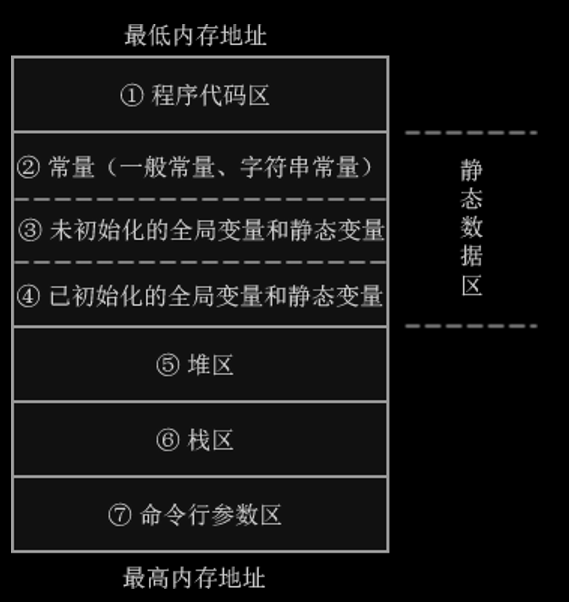

## 内存类型

变量有4种存储类别：auto（自动）、register（寄存器）、static（静态）和extern（外部）

内存中运行着很多程序，我们的程序只占用一部分空间，这部分空间又可以细分为以下的区域：

| **内存分区**          | **说明**                                                     |
| --------------------- | ------------------------------------------------------------ |
| 程序代码区(code area) | 存放函数体的二进制代码                                       |
| 静态数据区(data area) | 也称全局数据区，包含的数据类型比较多，如全局变量、静态变量、一般常量、字符串常量。其中：     全局变量和静态变量的存储是放在一块的，初始化的全局变量和静态变量在一块区域，       未初始化的全局变量和未初始化的静态变量在相邻的另一块区域。   常量数据（一般常量、字符串常量）存放在另一个区域。    注意：静态数据区的内存在程序结束后由操作系统释放。 |
| 堆区(heap area)       | 一般由程序员分配和释放，若程序员不释放，程序运行结束时由操作系统回收。malloc()、calloc()、free() 等函数操作的就是这块内存  注意：这里所说的堆区与数据结构中的堆不是一个概念，堆区的分配方式倒是类似于链表。 |
| 栈区(stack area)      | 由系统自动分配释放，存放函数的参数值、局部变量的值等。其操作方式类似于数据结构中的栈。 |
| 命令行参数区          | 存放命令行参数和环境变量的值，如通过main()函数传递的值。     |

