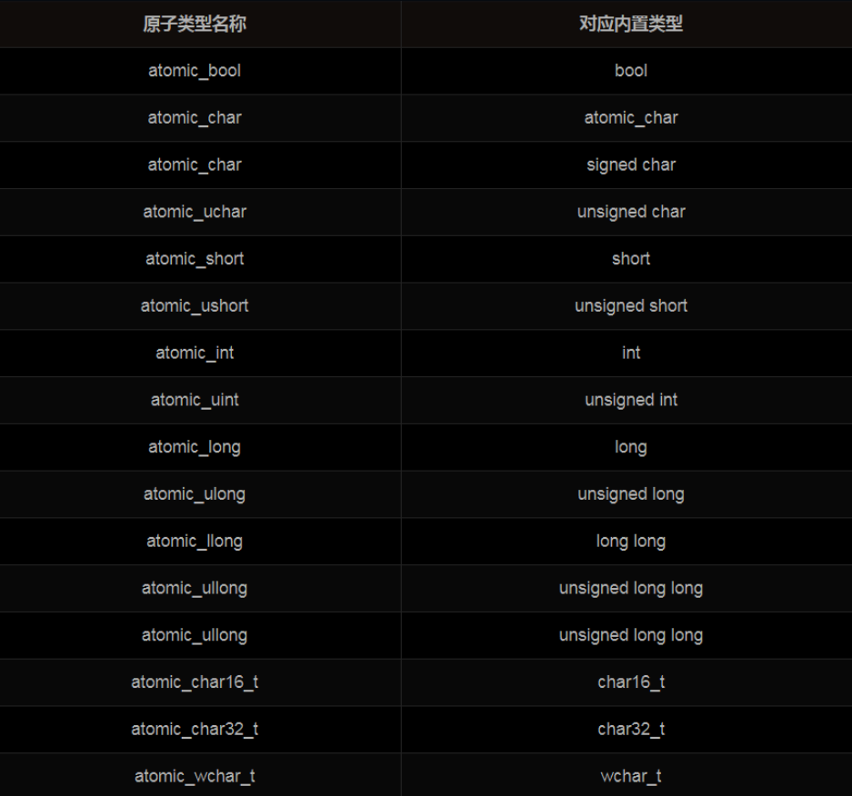

1. 认识原子操作
   原子操作是在多线程程序中“最小的且不可并行化的”操作，意味着多个线程访问同一个资源时，有且仅有一个线程能对资源进行操作。通常情况下原子操作可以通过互斥的访问方式来保证，例如Linux下的互斥锁（mutex），Windows 下的临界区（Critical Section）等。下面看一个Linux环境使用 POSIX 标准的 pthread 库实现多线程下的原子操作：

```c++
#include <pthread.h>
#include <iostream>
using namespace std;

int64_t total=0;
pthread_mutex_t m=PTHREAD_MUTEX_INITIALIZER;

//线程函数，用于累加
void* threadFunc(void* args)
{
        int64_t endNum=*(int64_t*)args;
        for(int64_t i=1;i<=endNum;++i)
        {
                pthread_mutex_lock(&m);
                total+=i;
                pthread_mutex_unlock(&m);
        }
}

int main()
{
        int64_t endNum=100;
        pthread_t thread1ID=0,thread2ID=0;

        //创建线程1
        pthread_create(&thread1ID,NULL,threadFunc,&endNum);
        //创建线程2
        pthread_create(&thread2ID,NULL,threadFunc,&endNum);

        //阻塞等待线程1结束并回收资源
        pthread_join(thread1ID,NULL);
        //阻塞等待线程2结束并回收资源
        pthread_join(thread2ID,NULL);

        cout<<"total="<<total<<endl;    //10100
}
```

上面的代码，两个线程同时对 total 进行操作，为了保证total+=i 的原子性，采用互斥锁来保证同一时刻只有同一线程执行total+=i操作，所以得出正确结果total=10100。如果没有做互斥处理，那么 total 同一时刻可能会被两个线程同时操作，即会出现两个线程同时读取了寄存器中的 total 值，分别操作之后又写入寄存器，这样就会有一个线程的增加操作无效，会得出一个小于 10100 随机的错误值。

2. C++11 实现原子操作
   在 C++11 之前，使用第三方 API 可以实现并行编程，比如 pthread 多线程库，但是在使用时需要创建互斥锁，以及进行加锁、解锁等操作来保证多线程对临界资源的原子操作，这无疑增加了开发的工作量。不过从 C++11 开始，C++ 从语言层面开始支持并行编程，内容包括了管理线程、保护共享数据、线程间的同步操作、低级原子操作等各种类。新标准极大地提高了程序的可移植性，以前的多线程依赖于具体的平台，而现在有了统一的接口。

C++11 通过引入原子类型帮助开发者轻松实现原子操作。

```c++
#include <atomic>
#include <thread>
#include <iostream>
using namespace std;  // 注意！！！！别把这个忘了

atomic_int64_t total = 0;       //atomic_int64_t相当于int64_t，但是本身就拥有原子性

//线程函数，用于累加
void threadFunc(int64_t endNum)
{
    for (int64_t i = 1; i <= endNum; ++i)
    {
        total += i;
    }
}

int main()
{
    int64_t endNum = 100;
    thread t1(threadFunc, endNum);
    thread t2(threadFunc, endNum);

    t1.join();
    t2.join();

    cout << "total=" << total << endl;    //10100
}
```

程序正常编译并运行输出正确结果total=10100。使用C++11提供的原子类型与多线程标准接口，简洁地实现了多线程对临界资源的原子操作。原子类型C++11中通过atomic<T>类模板来定义，比如atomic_int64_t是通过typedef atomic<int64_t> atomic_int64_t实现的，使用时需包含头文件<atomic>。除了提供atomic_int64_t，还提供了其它的原子类型。常见的原子类型有：

