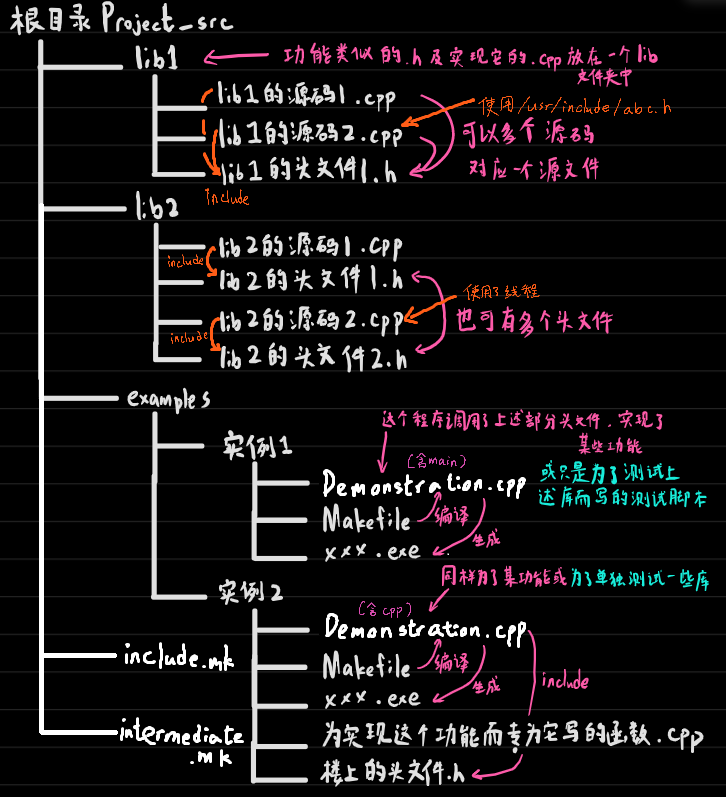

## gcc/g++命令行参数

c语言正式编译流程：

预编译处理（处理include，define啥的），生成.i文件

编译处理（生成汇编代码），生成.s文件

汇编处理（生成二进制），生成.o文件

链接处理（多个二进制代码文件合并），生成.exe(windows)或.out(linux)文件

（其实什么文件名并不重要，增加-x权限就能强制运行了）

通用参数：

| **对应参数：** | 作用                                                         |
| -------------- | ------------------------------------------------------------ |
| -E(不常用)     | 进行预编译处理                                               |
| -S(不常用)     | 进行预编译处理+编译处理                                      |
| -c             | 进行预编译处理+编译处理+汇编处理                             |
| [什么也不写]   | 进行预编译处理+编译处理+汇编处理+链接处理                    |
| -o             | 指定输出文件的文件名                                         |
| -I(大写的i)    | 如果这个.cpp文件包含了一个非同级目录的头文件.h，则要写-I，后面跟上搜索目录，如-I ./xxx/xxx，==一个-I只能跟一个目录==，若要包含多个目录，那就多写几个-I |
| -L             | -L后面跟上的目录为库文件(.dll .lib)的搜索目录，因为链接程序的时候可能要索取一些库文件的信息，所以需要给出库文件的路径；但是程序执行的时候加载动态库是根据另一套的，[linux见此md](./linux平台下动态链接库.md)，windows下好像是找 |
| -l后面接库名   | 如-lpthread，表示去上述-L参数描述的路径和默认路径中寻找明教libpthread.so的动态链接库（linux的动态链接库都应该以lib开头，以.so结尾，中间是它的名字） |

不管是生成.o时还是链接成可执行文件时都需要-I、-L、-l库名

## 我喜欢的项目结构

<div align=left></div>


## 如何写上述项目结构的Makefile

主要思想：

就是把上述所有出现的.cpp都编译为.o文件，放在与`包含main入口的.cpp`的同级目录里（而这个cpp对应Makefile也应与它同级）

然后一句直接编译出最终的.exe，将上述所有的.o作为它的依赖项，让gcc自己决定用哪个

------

include.mk:

```makefile
DEPENDENCIES = lib1的源码1.o lib1的源码2.o lib2的源码1.o lib2的源码2.o
# 构建最终目标Demostration的依赖项为以上所有.o文件，所以为了生成以上全部.o文件，make会把下方所有的.cpp按照依赖关系转为.o，不管最终的Demonstration用不用得到，我全把它编译出来，gcc自己决定用哪个
VPATH := ../../lib1/ ../../lib2/s
# make在搜索依赖关系的时候是不知道这些.cpp和.h在哪里的，VPATH是make机制预留的特殊变量，用于告诉make去哪里找
EXTRA_LIB = `pkg-config --cflags --libs opencv4` -lpthread
# 可能会用上的动态库
EXTRA_INCLUDE_PATH = -I /usr/include/
# lib1的源码2.cpp需要/usr/include/中的abc.h，这种奇葩路径得告诉编译器
optimize_mode = -O2
# -O2编译模式是超级优化 -g 编译模式是编译成可调试程序，想要用valgrind或gdb就得在上面填-g

```

intermediate.mk:

```makefile
General_compile_command=g++ $(optimize_mode) -c $< -o $@ $(EXTRA_LIB) $(EXTRA_INCLUDE_PATH)
# 反正对于所有文件编译指令都是“几乎”一样的，除了-c和-o的文件名要根据编译目标而不同，不如把它单独提出来
# $<表示生成.o文件的第一个prerequisites，也就是那个.cpp，只要用这种“自动变量”，就可以自动适配各种目标
# $@表示goal，也就是冒号前面的内容，如（lib1的源码1.o，lib1的源码2.o）

lib1的源码1.o:lib1的源码1.cpp lib1的头文件1.h
	$(General_compile_command)

lib1的源码2.o:lib1的源码2.cpp lib1的头文件1.h
	$(General_compile_command)

lib2的源码1.o:lib2的源码1.cpp lib2的头文件1.h
	$(General_compile_command)

lib2的源码2.o:lib2的源码2.cpp lib2的头文件2.h
	$(General_compile_command)

Demonstration.o:Demonstration.cpp Demonstration.h
	$(General_compile_command)
	
Demonstration:$(DEPENDENCIES) Demonstration.o
	g++ -g $^ -o $@ $(EXTRA_LIB) $(EXTRA_INCLUDE_PATH)
# 生成最终可执行文件和编译成.o的编译指令不太一样，需要单独写，因为不需要-c了
# $^代表冒号后面的所有内容，这里的话冒号后面又包含了个变量，所以此处$^展开就是一大长串.o文件列表

clean:
	rm -f $(OUTPUT_NAME)
	rm -f *.o
# 这个是特殊内置字段clean，不是实际文件，输入make clean时会自动执行这个

.PHONY:clean_intermediates
# .PHONY用于声明后面的那个玩意不是实际的文件，而是类似特殊命令的东西，因此也不需要prerequisites
# 写这个的作用就是如果有别的goal包含了clean_intermediates，就执行它下面的内容
# 具体怎么用看下面的makefile
clean_intermediates:
	rm -f *.o
```

Makefile:

```makefile
all:Demonstration clean_intermediates
# 执行make命令时，若发现的第一个目标是all，则会把all设为第一目标，然后尝试生成all的prerequisites
# 此处all包含了Demonstration和clean_intermediates，先执行前面那个，按照顺序编译所有玩意然后生成一个可执行文件，第一个目标完成了，就开始执行第二个“目标”clean_intermediates，它所包含的目标是清除所有中间文件
# 因此这样就可以达到编译出最终文件后文件夹里也不会有一大堆乱七八糟的.o
include ../../Makefile_include_examples.mk
```

