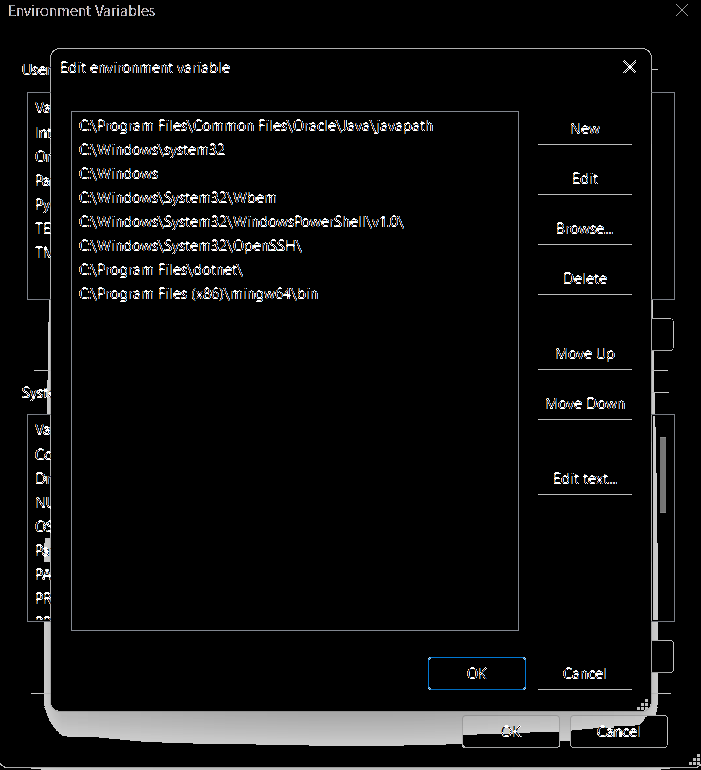

## 1.下载编译器(mingw-w64或tmd-gcc)

tmd-gcc相当于加强版的mingw-w64，而mingw就是mingw-w64的前辈，是个只能编译出32位程序的辣鸡，tmd-gcc和mingw-w64选一个就行了，不过下方还是分别给了两种的安装方法

* ### 1.1下载mingw-w64

去sourceforge的官网https://blog.csdn.net/weixin_36466834/article/details/119569365，滑动到下面

下载这种x86_64-win32-seh

或者用笔记附带的下载好的[文件](./)

* ### 1.2下载tmd-gcc

去这https://jmeubank.github.io/tdm-gcc/，点击release下载

然后点击这个

## 2.安装并添加环境变量

### 2.1安装mingw-w64

 { 控制面板\系统和安全\系统 → 点击页面左侧的高级系统设置 → 点击环境变量 → 双击系统变量下的PATH进行添加 }  

假如我把解压出来的拷贝到这里去了

设置完以后就可以开cmd输一下gcc或g++，看有没有反应

### 2.2

没什么好说的，安装包傻瓜式安装，建议默认c盘
