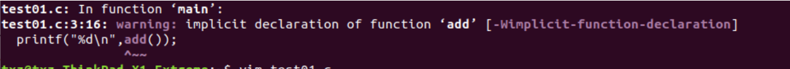

## 结论：

头文件不要也行，本质上是一种给人看的"目录"，让你知道那些函数的需要什么类型的参数，什么类型的返回值。实际使用中是辅助编译器检查语法错误的。

## 实验1：

一直想不明白，函数声明的作用。在include中我们只是把函数的声明放入代码了，调用函数的具体实现还是要看函数的定义，那么include函数声明到底有什么作用呢？按理说我只要能正确链接对应的函数定义就可以了呀？

在参考的博客中看到这么一段话：”其实函数声明的作用是让编译器帮你检查你调用函数时有没有错误。比如参数的数量是否正确，如果调用函数时候少传入一个参数，并且没有声明该函数，编译器无法知道你调用是否正确，只会提示一个警告。很多人会忽略警告，导致最后程序运行时出现异常。“

我尝试了下不声明函数（也不定义），直接在main中调用，然后编译代码，确实仅仅报出未定义的warning：



下面做一个实验，编写一个add函数的动态链接库和add函数声明的头文件，在test01.c文件中的并不include add.h头文件并直接在main中调用：

#### 包含main的主源码编译：

test01.c

```c++
#include<stdio.h>
int main(){
        printf("%d\n",add());
        return 0;
}
```

编译得到目标文件test01.o，会提示warning：implicit declaration of function ‘add’ ：

```bash
gcc -c test01.c -o test01.o
```

#### 动态链接库的编译：

add.h

```c++
int add();
```

add.c

```c++
#include "add.h"
int add(){
        return 12;
}
```

编译得到动态链接库libadd.so

```
gcc -shared -fPIC add.c -o libadd.so
```

#### 编译出可执行文件：

```bash
gcc test01.o -o test01 -L . -ladd -Wl,-rpath=/home/txz/
```

这说明，只要我们的对于函数的调用方式正确（返回值，参数等都正确）并且能正确链接到函数，那说明即便是在函数中不include 头文件（不声明函数）也是没有问题的！


## 实验2：

然后我们进行另一个实验，延续上面的代码但是把add.c和add.h中的add函数修改为：

```c++
int add(int u);
```

```c++
int add(int u){
        return u;
}
```

意味着我们在test01.c中的add调用方式其实是写错了的，没有传入参数。那么编译能不能通过呢？完全可以！没有任何报错和warning！！！

那么我们再在test01.c文件中include add.h头文件：

```c++
#include<stdio.h>
#include"add.h"
int main(){
        printf("%d\n",add());
        return 0;
}
```

编译报错，因为输入参数格式不对

```
test01.c: In function ‘main’:
test01.c:4:16: error: too few arguments to function ‘add’
  printf("%d\n",add());
                ^~~
In file included from test01.c:2:0:
add.h:1:5: note: declared here
 int add(int u);
     ^~~
```

所以说假如在代码中出现函数的传入参数出错等问题的话，没有对函数进行声明会导致在编译阶段无法发现错误！因为没有通过函数声明的方式告诉在本文件中想要调用的这个函数的格式（返回值，类型，参数）！函数声明的作用就是为了在编译阶段对函数调用格式和用法就进行检查，检查你的调用方式和声明方式是否一致！
