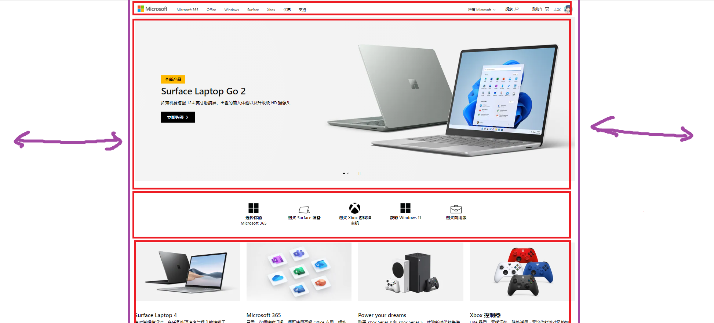
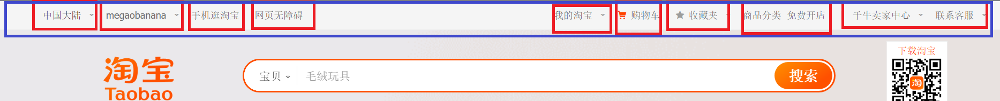

# 1.确定版心



大部分网站都是由块元素（红框）堆叠而成，然后再在这些块元素中添加子元素。因此这些最底层的块级元素布局很重要。

这些红框的宽度一般为了保证有序的布局，都会设置居中在画面中，并且==相同的宽度==，这些宽度就称为`版心`

在代码中通过创建一个.w类，然后让所有底层块级元素继承它就能实现格式统一，全部居中在画面中

```css
* {
    margin: 0;
    padding: 0;
}

.w {
	width: 1200px;
	margin: auto;
}
```


# 2.导航栏



实际开发中，我们不会直接使用链接a而是利用ul中包含li，li中包含a的做法

1. 这样语义更清晰
2. 不然会容易被搜索引擎辨别为有堆砌关键字的嫌疑