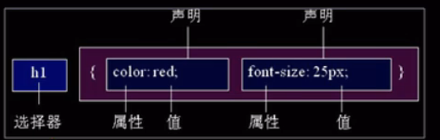

# CSS的主要使用场景是美化网页

`CSS`是层叠样式表（cascading style sheet）的简称，或级联样式表，CSS也是一种标记语言

CSS的价值：让HTML专注去做结构的呈现，而样式交给CSS，即结构与样式相分离


## CSS语法规范



"选择器" 描述的是给谁改样式，大括号里面的是改成什么样式，属性与属性值以键值对的形式出现，属性与属性值之间用冒号分割，多个键值对之间用分号隔开。

CSS脚本正常情况下是放在`<head>`中的`<style>`标签的

一个最基本的css：

```html
<!DOCTYPE html>
<html lang="en">
<head>
    <meta charset="UTF-8">
    <meta http-equiv="X-UA-Compatible" content="IE=edge">
    <meta name="viewport" content="width=device-width, initial-scale=1.0">
    <title>CSS*HTML</title>
    <style>
        p {
            font-size: 62px;
            color :khaki;
        }
    </style>
</head>
<body>
    <p>一个使用了CSS样式的标题</p>
</body>
</html>
```


## CSS书写风格

1. 选择器后大括号内展开为多行而不是写在一行
2. 用小写
3. 冒号后空一格，选择器和大括号中也来个空格


## 网页的哪里添加CSS

1. 行内样式表（行内式）

   是在元素标签内部的`style`属性中设定css样式，控制当前标签的样式，适合修改简单样式

   `<div style="color: red; font-size: 12px;"> 测试文本 </div>`

2. 内部样式表（嵌入式）

   写到html页面内部的，是将所有的CSS代码抽取出来，放到一个`<style>`标签中，style标签理论上可以放在任意地方，但一般是放在`<head>`标签中

3. 外部样式表（链接式）

   在`<head>`标签中写一句`<link rel="stylesheet" href=".css文件路径">`


## CSS书写顺序

1. 布局定位属性：display / position / float / clear / visibility / overflow
2. 自身属性：width / height / margin / padding / border / background
3. 文本属性：color / font / text-decoration / text-align / vertical-align / white-space / break-word
4. 其它属性：content / cursor / border-radius / box-shadow / text-shadow / ba...