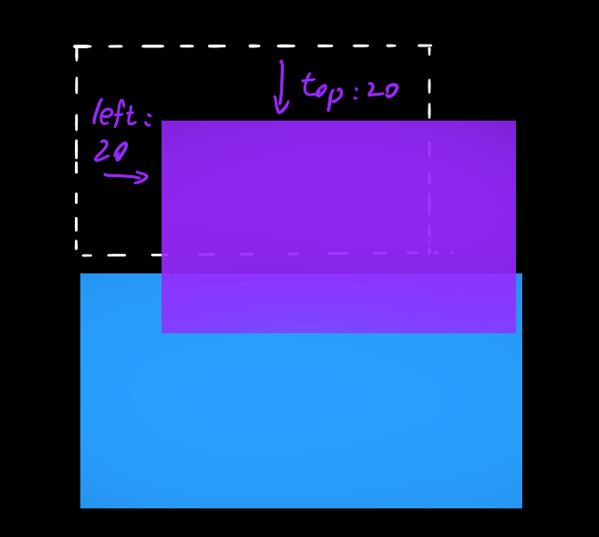
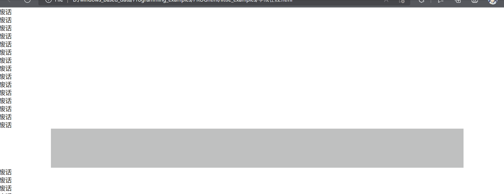

# 能干嘛

比如淘宝网上边有一条固定的栏，是不会随着画面而滚动的


## 定位模式

任何元素都可以添加一个position属性，写除了static以外的值就是使元素处于“定位模式”，其值可以分为四个：

| 值       | 语义     |
| -------- | -------- |
| static   | 静态定位 |
| relative | 相对定位 |
| absolute | 绝对定位 |
| fixed    | 固定定位 |


## 边偏移

边偏移就是定位的盒子移动到的最终位置。和margin和padding没有任何关系，下面这四个属性是指定移动“定位”模式的盒子的，“浮动”和“标准流”模式的盒子不能拥有以下属性（但一个元素可以同时是“浮动”和“定位”）

| 边偏移属性 | 示例        | 描述                                   |
| ---------- | ----------- | -------------------------------------- |
| top        | top:80px    | 定义元素相对于其父元素==上==边线的距离 |
| bottom     | bottom:80px | 定义元素相对于其父元素==下==边线的距离 |
| left       | left:80px   | 定义元素相对于其父元素==左==边线的距离 |
| right      | right:80px  | 定义元素相对于其父元素==右==边线的距离 |


## 静态定位

即无定位，标准流，元素的默认定位方式


## 相对定位☆

相对定位元素在移动位置的时候，是相对于它原来的位置来说的。



相对定位其==原来==在标准流中的位置继续占有，后面的盒子仍然以标准流的方式对待它（不脱标，跟浮动不同，浮动的情况下蓝色盒子会占有紫色盒子原先的地盘）


## 绝对定位

绝对定位的元素在移动位置的时候，是相对于它父/祖父容器来说的

1. 如果一个子元素没有父元素，或者父元素没定位，则以浏览器为基准
2. 如果父/祖父元素有定位（相对、绝对、固定），则以==最近一级==的有定位得的祖先元素为参考点移动位置
3. 绝对定位元素不再占有原先的定位

> ==子绝父相==：子元素用绝对定位，父元素用相对定位，父元素需要占有位置，所以是相对定位，子元素不需要，所以绝对定位


## 固定定位

固定定位是元素固定于浏览器==可视区域==的位置，主要使用场景：可以在浏览器页面滚动时元素的位置不会改变

固定定位可以看做是一种特殊的绝对定位

处于固定定位模式的元素同样不保留位置


## 粘性定位

position:sticky。某个元素添加完这个属性后乍看不会有什么变化，但是当页面往下滚动，这个元素快要被滚出画面时，它就会变成固定定位，定位在top、left...指定的位置

粘性定位的特点：

1. 以浏览器的可视窗口为参照点移动元素（固定定位的特点）
2. 粘性定位占有原先的位置（相对定位的特点）
3. 必须添加top、left、right、bottom其中的一个才生效

下图是{*position* : sticky; *top* :0px; }的效果




## 定位叠放顺序

```
选择器 { z-index: 1;}
```

z-index后面的数字越大越靠上
