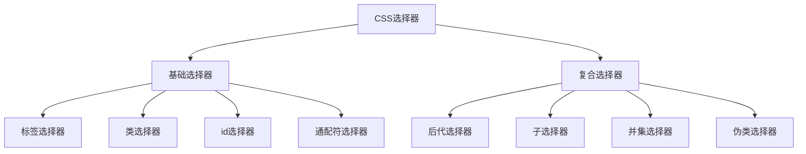

### 标签选择器：

最简单，直接把标签名写上就行了 `p { ...键值对... }`，但也无法实现差异化

 

### 类选择器：

选择一个或几个标签，语法：`.类名 {...键值对...}`，然后在需要使用这些格式的标签里加上一个属性`class="类名"`，如：

```css
.boy {
    color: blue;
}
...
<ul>
	<li class = "boy"> 学生A </li>
	<li> 学生B </li>
	<li> 学生C </li>
	<li class = "boy"> 学生D </li>
</ul>
```

一般情况下，常用的类是有==规定的名字==的，就别自己随便想一个名字了，见《web前端开发手册》

------

其实，`class="类名1 类名2 类名3 ..."`，一个标签可以继承不止一个类，中间用==空格==隔开

类选择器还可以这样写`a.boy`，这样选择出的只有同时是`<a>`且`class=boy`的标签


### id选择器：

HTML元素以id属性来设置id选择器，CSS中id选择器以"#"来定义，`#sexy {color: pink;}`，使用：`<div id="pink">xxx</div>`

id选择器和类选择器很像，但是id就是id，identification，是只能被使用一次的，但是类选择器能被使用很多次


### 通配符选择器：

`* {...键值对...}`，不需要调用，自动给所有的元素使用样式；但一般特殊情况才会使用，如清除所有的元素标签的内外边距