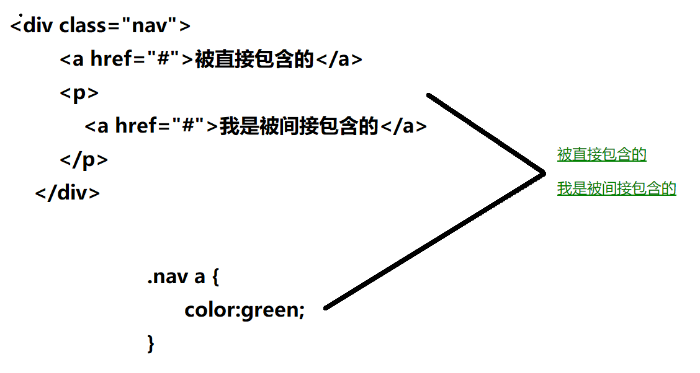
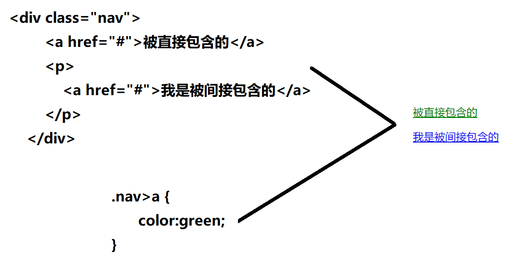
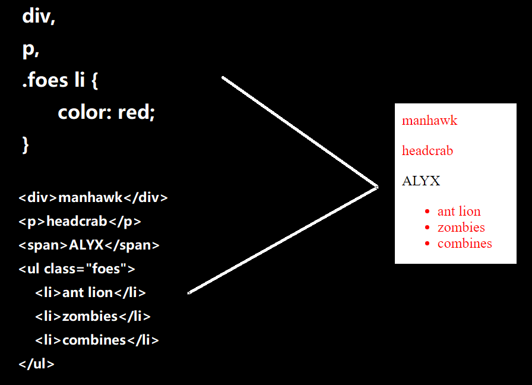

## 后代选择器（重要）

`后代选择器`又称为包含选择器

`元素1 元素2 元素3 ...{ 样式声明 }`上述语法表示选择元素1中的元素2中的元素3，它们属于==非直接==包含关系，元素可以是`标签选择器`，也可以是`类选择器`，也可以是`id选择器 `

如下：我只想把ol中li改为红色，ul中的不改，怎么办呢

```css
<ol>
    <li></li>
    <li></li>
    <li></li>
    <li></li>
    <li></li>
</ol>
<ul>
    <li></li>
    <li></li>
    <li></li>
    <li></li>
    <li></li>
</ul>
```

使用后代选择器

```css
ol li {
    color:red;
}
```

## 子选择器

只能选出作为某元素的最近一级的子元素，简单理解`后代选择器`选出了一个父亲的儿子、孙子、重孙子，`子选择器`只选出父亲的亲儿子。

如下面这个案例，我只想让 "被直接包含的" 这句话变成绿色，如果使用刚才的后代选择器，就会把\<p>标签内的\<a>也给选出来



子元素选择器与后代选择器的区别就是==用`>`代替空格==。



 

## 并集选择器

`并集选择器`可以选择多组标签，同时为它们定义相同的样式。通常用于集体声明。

`并集选择器`是各元素通过英文逗号`,`连接而成，任何形式的选择器（包括其它复合选择器0）都可以作为并集选择器的一部分。




## 伪类选择器

#### 链接伪类选择器：

```css
a:link /* 选择所有未被访问的链接 */
a:visited  /* 选择所有已经被访问的链接 */
a:hover  /* 选择鼠标指针位育其上的链接 */
a:active  /* 选择鼠标按下未弹起的链接 */
```

为了确保生效，请按照LVHA(love hate)的顺序声明：:link - :visited - :hover - :active

#### 表单元素伪类选择器：

:focus 伪类选择器用于选取获得焦点的表单元素

```css
input:focus{
	background-color:yellow
}
```

