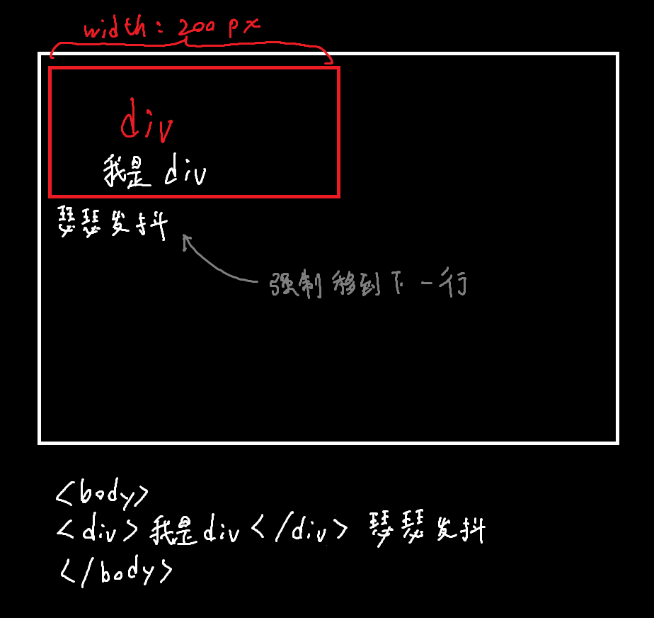
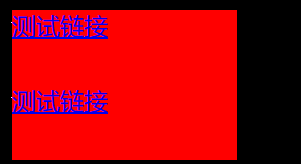

## CSS元素显示模式

HTML中成千上万的标签一共可以分成两类：`块元素`和`行内元素`两种类型

#### 块元素：

典型块元素：`<h1>~<h6>`、`<p>`、`<div>`、`<ul>`、`<ol>`、`<li>`等，其中<font color=red>\<div></font>是最典型的块元素

特点：

1. 比较霸道，自己独占一行

2. 高度，宽度、外边距以及内边距都可以控制

3. 宽度默认是父容器的100%，但就算使用css将容器宽度修改为小于父容器，==它还是独占一行==，下面的信息不会跑到剩余的空间中

   

4. 是一个容器及盒子，里面可以放行内或块级元素

------

* 注意：文字类的标签内不能使用块级元素

  如\<p>、\<h1~6>都是文字类块级标签，里面不能放其它块级元素，特别是\<div>


#### 行内元素：

常见的行内元素有`<a>`、`<strong>`、`<b>`、`<em>`、`<del>`、`<ss>`、`<u>`、`<span>`，其中`<span>`是最典型的行内元素，行内元素又称内联元素。

特点：

1. 相邻行内元素在一行上，一行可以显示多个
2. 宽、高直接设置是==无效的==
3. 默认宽度就是它内部内容的宽度
4. 行内元素只能容纳文本或其他行内元素，==不能容纳块元素==

------

* 注意：特殊情况下，\<a>里面可以再塞块级元素，先转化为块级模式最安全，<a\>内的元素不能继承父中的字体等属性，需要单独设置


#### 行内块元素：

在行内元素中有几个特殊的标签——``、`<input />`、`<td></td>`它们同时具有块元素和行内元素的特点

特点：

1. 和相邻行内元素及行内块在一行上，但是它们之间会有空白细缝，一行可以显示多个（行内元素特点）
2. 默认宽度就是它本身内容的宽度（行内元素的特点）
3. 高度、行高、外边距以及内边距都==可以控制==（块级元素特点）


## 元素显示模式的转换：

比如说，我们想要增加\<a>的触发范围，但是行内元素又不能直接设置宽高，那么就需要先转换为块级元素

想要转换，需要先新建一个选择器，然后在里面声明一行`display: block;`(转换为块级元素)，`display:inline`(转换为行内元素)，`display:inline-block`(转换为行内块元素)

如下：

```html
<!DOCTYPE html>
<html lang="en">
<head>
    <meta charset="UTF-8">
    <meta http-equiv="X-UA-Compatible" content="IE=edge">
    <meta name="viewport" content="width=device-width, initial-scale=1.0">
    <title>Document</title>
    <style>
        a{
            width: 150px;
            height: 50px;
            background-color: red;
            display: block;
        }
    </style>
</head>
<body>
    <a href="#">测试链接</a>
    <a href="#">测试链接</a>
</body>
</html>
```



如果不加`display: block;`，就会变成这样，宽高的修改不起作用，并且两个链接保持在同一行

