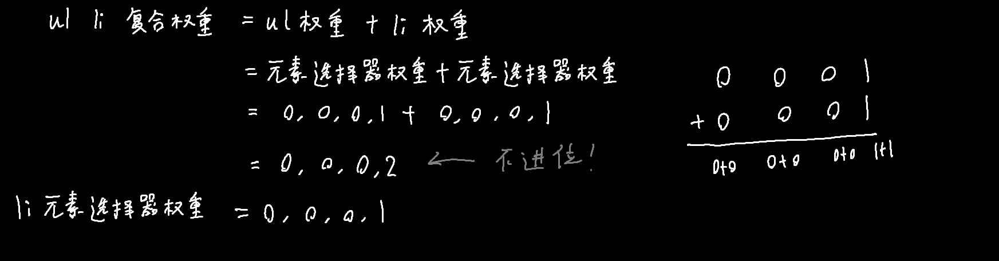
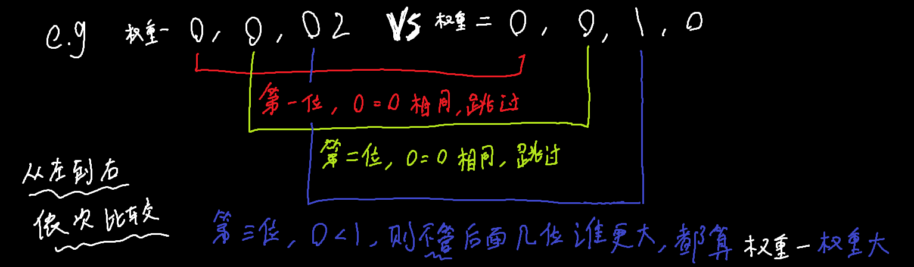

# 层叠性、继承性、优先级

## 层叠性：

相同选择器给设置相同的样式，此时样式就会覆盖（层叠）另一个冲突的样式，以解决冲突问题

层叠性原则：

* 样式冲突，遵循==就近原则==，哪个样式离结构近，就执行哪个样式

## 继承性：

子标签会继承父标签中的==某些==样式，如给div设置color:red;，那\<p>中的文字也会变红

```html
<div>
	<p>
        测试文本
    </p>
</div>
```

color, text- ,font- ,line- 这些元素开头的可以继承

> line-height不写单位时比较特别
>
> 假设父容器的行高为1.5，没有单位，有两个子容器继承自它
>
> 如果第一个子容器的font-size设置为14px，则它的行高=14*1.5px
>
> 如果第二个子容器的font-size设置为18px，则它的行高=18*1.5px
>
> 即line-height无单位时，具体的行高会因子容器的字体大小而变

## 优先级：

当一个元素同时被多个选择器选中，则需按照以下优先级解决冲突

* 选择器相同，则执行层叠性

* 选择器不同，则比较选择器之间的权重：

-----

### 第一步：计算权重

单基础选择器的权重取值参考下表就行了，至

  | 选择器                 | 选择器权重 |
  | ---------------------- | ---------- |
  | 继承 或 *              | 0,0,0,0    |
  | 元素选择器             | 0,0,0,1    |
  | 类选择器 或 伪类选择器 | 0,0,1,0    |
  | ID选择器               | 0,1,0,0    |
  | 行内样式 style=""      | 1,0,0,0    |
  | !important             | $\infty$   |

复合选择器涉及到权重叠加，计算时只相加不进位，复合选择器中每个基础选择器权重取值按照上表。



-------

### 第二步：比较权重



##### 例子：

下述html中使用复合选择器和元素选择器同时对`<li>`进行了样式修改，为什么最终会执行复合选择器的样式

```html
<!DOCTYPE html>
<html lang="en">
<head>
    <meta charset="UTF-8">
    <meta http-equiv="X-UA-Compatible" content="IE=edge">
    <meta name="viewport" content="width=device-width, initial-scale=1.0">
    <title>Document</title>
    <style>
        ul li {
            color: green;
        }
        li {
            color: red;
        }
    </style>
</head>
<body>
    <ul>
        <li>a</li>
        <li>b</li>
        <li>c</li>
        <li>d</li>
        <li>e</li>
    </ul>
</body>
</html>
```

