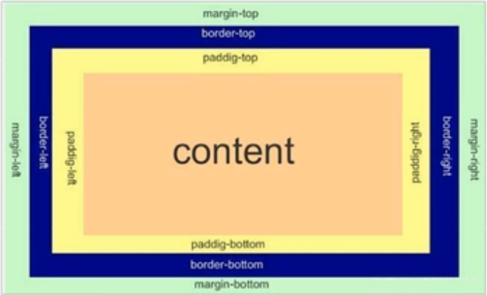

网页布局三大核心：盒子模型、浮动、定位

## 盒子模型的组成

1. border边框
2. content内容
3. padding内边距
4. margin外边距

## border边框

border-top/bottom/right/left-width: ?px;

border-top/bottom/right/left-style: none | hidden | dotted | dashed | solid | double | groove | ridge | inset |  outset;

border-top/bottom/right/left-color: 颜色;

复合写法：

border-top/bottom/right/left: 5px solid red;

或者直接修改四条边

border: 5px solid red;

注意边框增粗时不是往里面增粗的，是往外面增粗的

## padding内边距

padding-left / padding-right / padding-top / padding-bottom: ?px

或padding: ?px ?px ?px ?px; 上右下左

或padding: ?px ?px; 第一个问号是上和下的值，第二个是左和右的值

需注意当“盒子”原先大小已定时，再增加内边距，就会把原先的盒子撑大

> 以下情况下盒子不会被撑大：
> 比如块元素默认和父容器宽度相同，此时再增加左右的padding不会增加宽度，不然总不能把父容器一起撑大吧

#### padding的用处：

让盒子宽能够随内容长度而自动调整，具体做法就是不给width，只给padding

## margin外边距

margin-left / margin-right / margin-top / margin-bottom: ?px 

或padding: ?px ?px ?px ?px 上右下左

* 应用：块级元素水平居中，此块需要满足的条件：

	1. 盒子必须指定了宽度（width）
	2. 盒子的左右外边距设置为auto，上下无所谓

* 以上方法是让块级元素水平居中，行内元素或行内块元素水平居中给其父元素添加 text-align-center即可

## 实际使用

有时使用`padding`和`margin`都能控制元素在画面中的位置，理论上可以混用，怎么方便怎么来
