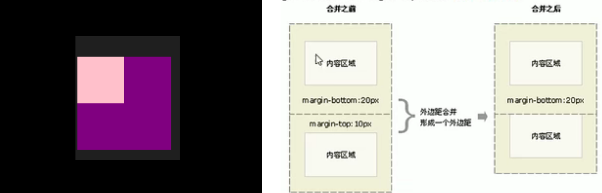
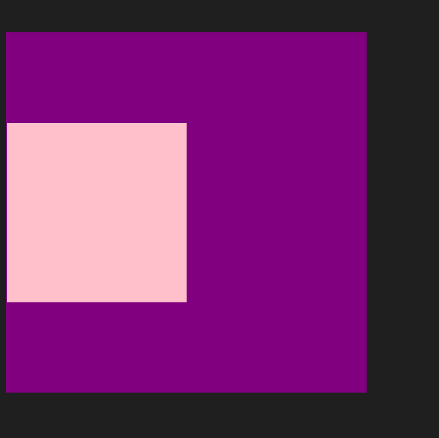

如下：对于两个有嵌套关系的块元素，父元素有`上外边距`的同时子元素也有`上外边距`，此时父元素会塌陷较大的外边距值

```html
<!DOCTYPE html>
<html lang="en">
<head>
    <meta charset="UTF-8">
    <meta http-equiv="X-UA-Compatible" content="IE=edge">
    <meta name="viewport" content="width=device-width, initial-scale=1.0">
    <title>Document</title>
    <style>
        .father {
            margin-top: 50px;
            width: 400px;
            height: 400px;
            background-color: purple;
        }
        .son {
            width: 200px;
            height: 200px;
            background-color: pink;
            margin-top: 100px;
        }
    </style>
</head>
<body>
    <div class="father">
        <div class="son"></div>
    </div>
</body>
</html>
```



解决方案：

1. 可以为父元素定义上边框（比如来个1像素的透明边框，反正也看不见，只是用来防止元素塌陷的）
2. 可以为父元素定义上内边距
3. 可以为父元素添加overflow:hidden;

就拿上述解决方案中的思路1举例，只==要==给上述代码的`.father {}`中加上如下就能避免塌陷

```css
border: 1px solid transparent
```

