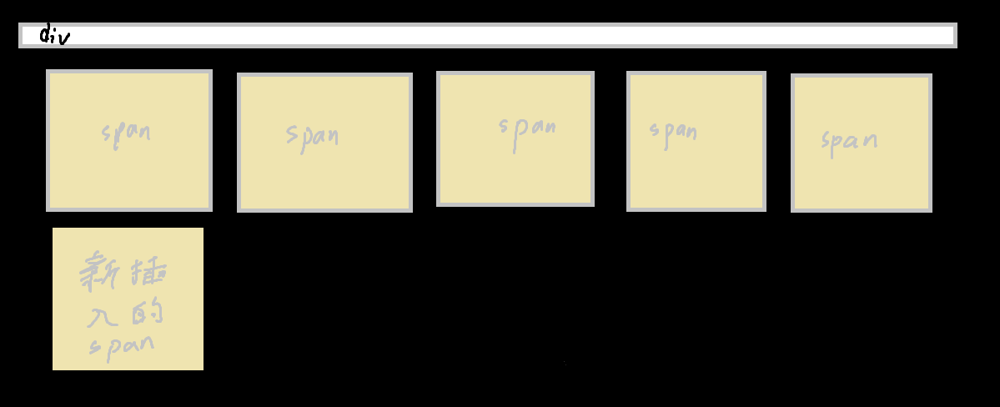

CSS提供了三种传统布局方式：

* 普通流（标准流）
* 浮动
* 定位

## 标准流/普通流/文档流

就是行内元素、块元素按照默认的逻辑摆放

1. 块级元素独占一行，从上到下顺序排列
2. 行内元素按照顺序，从左到右顺序排列，碰到父元素边缘则会自动换行


## 浮动

网页布局原则：

多个块级元素纵向排列就使用`默认的标准流`、多个块级元素横向排列用`浮动`

float属性用于创建浮动框，将其移动到一边，直到左边缘及 触及 ==包含块==或另一个浮动框的边缘

语法：

```css
float: 属性值;
```

| 属性值 | 描述                 |
| ------ | -------------------- |
| none   | 元素不浮动（默认值） |
| left   | 元素向左浮动         |
| right  | 元素向右浮动         |

#### ☆浮动特性☆： 

1. 浮动元素会脱离标准流的控制（脱标）

   

   加入有两个<p\>标签，其中一个设成了“浮动”，可以看做它飘到上层去了，那第二个红色的<p\>一看前面没东西了，就会去白色<p\>原本的地方

2. 浮动的元素会一行内显示并且元素==顶部对齐==，与父级元素的边框对齐

3. 浮动的元素会具有行内块元素的特性

4. 有三个<p\>标签，第一个不浮动，第二个浮动，第三个不浮动。

   

   那么实际上第二个盒子不会像预料的一样，“飞”到第一个盒子上面，因为第一个还是传统的标准流，它占领一行以后，别的元素是没法跑到它的上面去的。

   例2：有三个<p\>标签，第一个浮动，第二个不浮动，第三个浮动。

   

   第三个\<p>不会像预想的一样贴在第一个\<p>的左边，而是在二下面。

   也就是说，==浮动元素只会影响浮动盒子后面的标准流，不会影响前面的标准流==

   > 因此设计时，一个元素浮动了，理论上其余并列兄弟元素也要跟着浮动，就可以避免上述这种奇怪的问题


## 与标准流的父亲搭配

为了约束浮动元素的位置，我们网页布局一般采取的策略是：先用标准流的父元素排列上下位置，之后内部子元素采取浮动排列左右位置。


## 清除浮动(清除浮动元素造成的影响)：


因为刚才讲需要与标准流父容器搭配，但是默认情况下父容器的==高==是定死的，设计得正好只能在里面塞五个span

但是哪一条我想再给div中来一个子元素span，那还得手动调整父容器的高，不然新插入的span就看不到了

很烦，那如果不写父容器的高，能够做到“父容器”的高随着子容器增多而自动增多吗？

不能。直接做会这样，div只剩一条线的高，这是因为浮动元素是在天上的，所占的体积是不会被纳入计算的



------

清除浮动的方法：

1. 额外标签法（隔墙法）
2. 父容器添加overflow属性
3. 父容器添加after伪元素
4. 父容器添加双伪元素

#### 额外标签法w3c推荐：

找到最后一个浮动的盒子，再后面再添加一个==块级元素==，这个==块级元素==必须包含一个属性：`clear: both`

这么做虽然简单易懂，当浮动元素很多时，每次都要在后面加个无意义的标签，结构化较差

#### overflow：

给父元素添加overflow，将其属性值设置为hidden

#### after高级：

先在css部分添加如下代码

```css
.clearfix:after {
    content: "";
    display: block;
    height: 0;
    clear: both;
    visibility: hidden;
}
.clearfix{
    *zoom: 1;
}
```

然后在父元素的class属性中再添加clearfix类就行了

上面那些代码表示：当父元素被添加进这个类时，就会自动在最后面（:after）添加一个空的块级元素（display:block），其被设置为clear: both；所以本质上就是第一种方法，但是添加方式更智能。

#### 双伪元素：

```css
.clearfix:before, .clearfix:after {
    content: "";
    display: table;
}
.clearfix:after {
 	clear: both;   
}
.clearfix {
    *zoom: 1;
}
```

然后在父元素的class属性中再添加clearfix类就行了