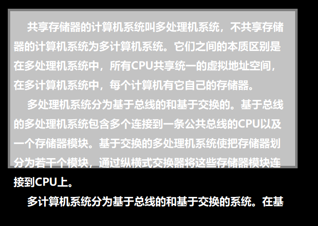

## display: 

display除了能写inline/block/inline-block，当值为none的时候就能起到隐藏元素的作用

display隐藏元素后，**不再**占用原来的位置

## visibility:

取值 inherit | visible | hidden

设置为hidden后保留原先的位置

## overflow:

比如上面的文字，盒子太小，字太多，造成溢出

overflow:visible 不剪切内容也不添加滚动条

overflow:hidden能将溢出的部分隐藏起来

scroll:添加滚动条 

overflow-x: hidden --?

``
