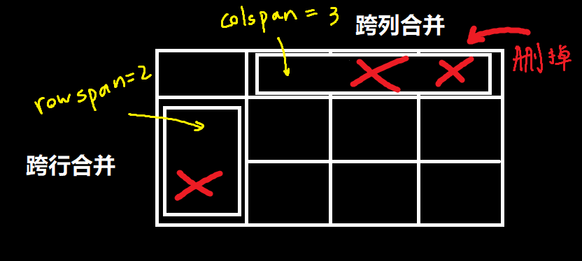

## 基本使用

```html
<table>
	<tr>
        <td>单元格内的文字</td>
        ...
    </tr>
</table>
```

`<tr>`（table row）是一行，必须嵌套在`<table>`中

`<td>`（table data）是单个格子，必须嵌套在`<tr>`中

`<th>`，表格中的第一行一般是表头，所以实际上表格的第一行的单元格一般是是用`<th>`代替`<td>`的，`<th>`单元格内的文字居中，且更粗，以把表头信息跟普通数据区分开

还有`<thead>`标签，除了建议把表格第一行中的单元格改为` <th>`外，还建议把这些单元格放在放在`<thead>`标签中，其余部分放在`tbody`中，这样做不会对表格的显示产生改变，但是会让源码变得更加清晰


## 合并单元格



若想要跨行合并，则要把合并代码（本质上是td的一个属性）写在最==上==侧的单元格中，`<td colspan = "2"></td>`

若想要跨列合并，则要把合并代码（本质上是td的一个属性）写在最==左==侧的单元格中，`<td rowspan = "3"></td>`

写完合并代码后，需要其余被覆盖的单元格删掉


<table>
    <tr> <th>a</th> <th colspan = "2">b</th> <th>c</th> </tr>
    <tr> <td>d</td> <td rowspan = "2">e</td> <td>e</td> <td>f</td> </tr>
    <tr> <td>f</td> <td>g</td> <td>h</td> </tr>
    <tr> <td>i</td> <td>j</td> <td>k</td> <td>l</td> </tr>
</table>
