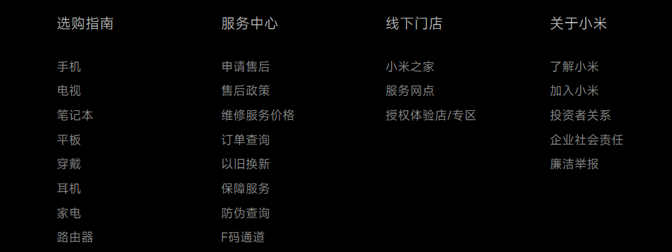

作用：布局，主要分为三类：有序列表、无序列表、自定义列表


## 无序列表

```html
<ul>
    <li>项1</li>
    <li>项2</li>
    <li>项3</li>
</ul>
```

注意点：

1. `<ul>`列表中只允许放`<li>`标签，什么`<p>`标签都不能放，而`<li>`中可以放任何标签，是个容器
2. 无序列表会有自己的样式属性，在实际使用中，会通过CSS来进行设置


## 有序列表(用的远没有无序列表多)

```html
<ol>
    <li>项1</li>
    <li>项2</li>
    <li>项3</li>
</ol>
```

注意点：

1. `<ol>`列表中只允许放`<li>`标签，什么`<p>`标签都不能放，而`<li>`中可以放任何标签，是个容器
2. 无序列表会有自己的样式属性，在实际使用中，会通过CSS来进行设置


## 自定义列表（或者叫有主题的列表）



可做这种效果

```html
<dl>
    <dt>关注我们</dt>
    <dd>新浪微博</dd>
    <dd>官方微信</dd>
    <dd>电话</dd>
</dl>
```

虽然`<dt>`描述的是类似于主题的东西，但是是允许有多个的