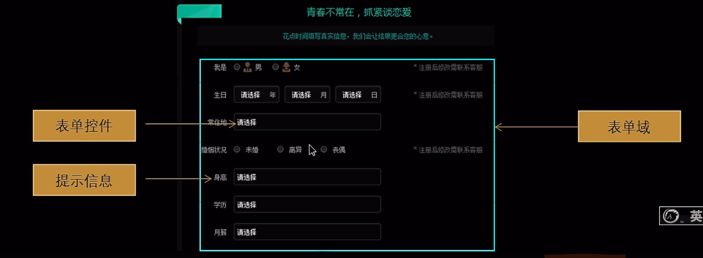
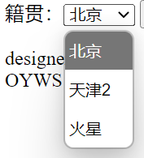

目的：为了收集用户信息

构成：表单域、表单控件（表单元素）和提示信息



------

#### 表单域（form双标签）：

属于`<form>、</form>`表单域内的信息会被收集并提交到服务器，form有三个重要的重要属性：

| 属性   | 属性值   | 作用                                                 |
| ------ | -------- | ---------------------------------------------------- |
| action | url地址  | 用于接收并处理表单数据的服务器程序url地址，"xxx.php" |
| method | get/post | 用于指定数据的提交方式                               |
| name   | 名称     | 用于指定表单的名称，以区分同一个页面内的多个表单域   |


------

#### 表单元素（input单标签）：

1. `<input/>`表单元素

   对，input元素是一个单标签，不需要成对出现。input标签中有一个必填属性值：`type`。根据不同的type属性值，可以让输入字段有很多种不同的形式

   | 属性值   | 描述                                                   |
   | -------- | ------------------------------------------------------ |
   | button   | 定义可点击按钮（多数情况下，是通过javascript启动脚本） |
   | checkbox | 复选框                                                 |
   | file     | 定义输入字段和"浏览"按钮，供文件上传                   |
   | password | 定义密码字段，该字段中文字被掩码                       |
   | radio    | 单选按钮                                               |
   | submit   | 定义提交按钮，提交按钮里面的字用value指定              |
   | text     | 定义单行的输入字段，用户可在其中输入文本               |

   

   | input标签的属性 | 属性值      | 作用                                                         |
   | --------------- | ----------- | ------------------------------------------------------------ |
   | name            | 自定义      | 定义名字，或者叫id，提交表单时发送的键值对中"键"名就是name的值 |
   | value           | 自定义      | 默认值                                                       |
   | checked         | 也是checked | 主要用在radio和checkbox，表示此选项框默认被勾上了            |
   | maxlength       | 正整数      | 主要用在文本输入型选项框上，表示最多输入的字符数             |
   | id              | 自定义      | 见`label`表单标签                                            |

   `radio`单选按钮在不指定name或name不同时不会起到单选效果。此外`checkbox`复选框也需要有相同的name值


------

#### 表单元素（select双标签）：

这种效果



```html
<select>
    <option>选项1</option>
    <option>选项2</option>
    <option>选项3</option>
    ...
</select>
```

`option`标签可以有一个`selected`属性，当属性值也为`selected`时，表示此选项是被默认选中的


------

#### 表单元素（textarea双标签）

使用场景：当有需要用户输入较多文字的地方，我们就不能使用文本框表单了，此时我们可以使用`<textarea>`标签，在表单元素中，`<textarea>`是用来定义多行文本输入框控件的代码

```html
<textarea row="3" cols="20">
    文本域内默认会显示的文字
</textarea>
```


------

#### 表单标签（label双标签）：

\<label>标签用于绑定一个表单元素，当点击\<label>标签内的文本时，浏览器就会自动将焦点（光标）转到或者选择到对应的表单元素上，使用起来更方便，增加==用户体验==。

```html
你的家乡是？&nbsp;<label for="nation">我的家乡是earth</label><br/>
我是地球人<input type="radio" name="planet" id="nation"/>
```

这样，点击"我的家乡是earth"时也能勾选上底下的radio按钮


