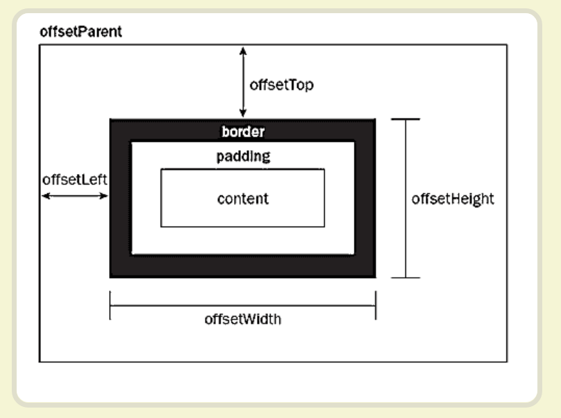

获取元素绝对位置：

获取元素后默认会找不到，offsetBottom这个属性，其实按上方的图示算一下就出来了

元素宽：元素对象.clientWidth 或 元素对象.clientHeight

## 动画细节：

1. 核心动画函数图像应该经过(0, 0)与(1, 1)，这样方便成比例缩放
2. 三角函数都是以弧度为单位的
3. 尽量模块化
4. clientwidth跟clientheight有可能反了？