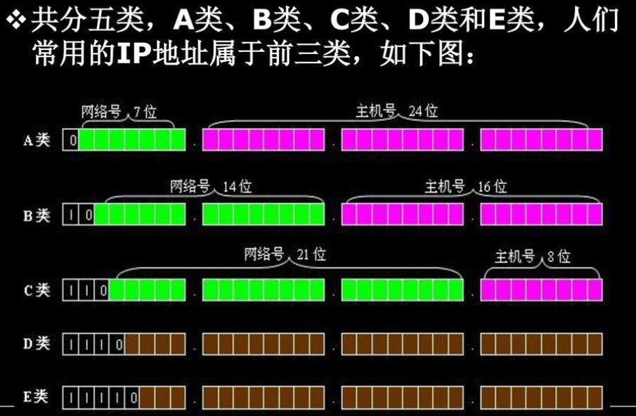

## 子网的意义

1. 方便管理，不同的子网可以相互隔离
2. 我们知道，IPv4的ip地址资源比较紧张，实际上整个互联网就是一个巨大的局域网，ip地址有限，那么通过划分子网，如何再在子网里面分配ip地址给子网的主机，这个时候同一一个ip就可以给一整个子网所共用，就解决了互联网ip不够的问题

既然要划分子网，要有一个规则，告诉路由器，IP的哪一部分是表示子网，哪一部分表示我在这个子网里面具体的地址

所以，实际上IP细来讲又分为三部分：`网络部分（network）` `子网段部分(subnetwork)`和`主机部分(host)`

一般大家喜欢把网络部分和子网部分合并成为网络地址(网络号)，把子网看做是网络的一部分，主机部分称为主机地址（主机号） 通俗理解：

> 网络号（subnetwork），表示我住哪个小区
>
> 主机号(host)，表示我家门牌号是多少

或者说网络号就是我们平时打电话的区号，主机号是你的电话号码，如010-80220110, 010是网络号，80220110是主机号

我们平常看到的192.168.0.x这样的IP，这是给我们看的地址，计算机内部计算把ip变成二进制，每一个IP被4个点分成4部分，每一部分有8位，也就是一个IP实际上是一个一共32位的二进制数

```
如 192.168.0.3 换成二进制是 11000000 10101000 00000000 00000011
```

然后，这个32位的数根据需要被分为五大类分，由IANA([全球互联网地址指派机构](https://link.zhihu.com/?target=https%3A//zh.wikipedia.org/wiki/%E4%BA%92%E8%81%94%E7%BD%91%E5%9C%B0%E5%9D%80%E6%8C%87%E6%B4%BE%E6%9C%BA%E6%9E%84))配给大家使用



```
一般来说这五类的用途大致分为：
A类保留给政府机构（0.0.0.0到127.255.255.255）
B类分配给中等规模的公司（128.0.0.0到191.255.255.255）
C类分配给任何需要的人（192.0.0.0到223.255.255.255）
D类用于组播（224.0.0.0---239.255.255.255）
E类用于实验（240.0.0.0---247.255.255.255）
A、B、C三类中IP地址=网络地址+主机地址，而D、E两类不区分网络地址和主机地址
特殊说明：
（1）A类中的 10.X.X.X是私有地址；127.X.X.X是保留地址
（2）B类中的 172.16.0.0~172.31.255.255是私有地址
（3）C类中的 192.168.X.X是私有地址
```

## 那么，是怎么样计算出来`网络号`和`主机号`的呢？

子网掩码会把一个IP地址按这个划分成这两部分，计算方法是通过把IP地址变成二进制，子网掩码也转成二进制后，两个二进制数按位做 **与运算。**

------

比如，一个C类地址，ip: 192.168.0.3 ，子网掩码是：255.255.255.0

第一步先转二进制

```
ip:   192.168.0.3   >  11000000 10101000 00000000 00000011
网掩码：255.255.255.0 >  11111111 11111111 11111111 00000000
```

然后两个二进制按位做与计算

```
11000000 10101000 00000000 00000000
```

即

```
192.168.0.0
```

192.168.0.0 这个就是我们的网络段（包括了上面说的网络部分和子网部分）
3 就是我们的主机号（主机在子网络里面的标识）


## CIDR(无类别域间路由)/VLSM（可变长子网掩码）

总结：就是用 `/数字`来表示原来255.255.255.0那种`点分式`的子网掩码

上面这个算法看起来有点难理解，另外一种CIDR(无类别域间路由)/VLSM（可变长子网掩码）的`表示法`跟容易看懂，如下面这个:

```text
192.168.0.3/24
```

24表示这个ip的32位二进制数的前24位是网络标识的前缀，剩下的8位是主机标识

剩下的8位里面，若全部是0则整个IP代表这个网络的标识，

全部是1则是是这个网络的子网内广播地址，其他是这个子网网络的==可用地址==

```text
192.168.0.3   =>  11000000 10101000 00000000 00000011

网络标识的前缀： 11000000 10101000 00000000 --（前24位）换算位10进制：192.168.0
网络标识: 11000000 10101000 00000000 00000000 --剩下8位全是0，转10进制是：192.168.0.0
广播地址  11000000 10101000 00000000 11111111 --剩下8位全是1，转10进制是：192.168.0.255
```

大家看，这个就很容易理解了，==除了网络标识和广播地址==这两个特殊地址，剩下8位里面其他二进制数就是其他主机的标识。

实际上，这个192.168.0.3/24 ,前24位全1，就是等于255.255.255.0是这个网络的子网掩码，而无类别域间路由是基于**可变长子网掩码（VLSM）**来进行任意长度的前缀的分配的，所以这个24也可以变成其他数，如16

```text
192.168.0.3/16
```

只有前16位是网络，后面是地址16标识，换算回来就是

```text
192.168.0.0 是网络标识（后16位二进制全位0）
192.168.255.255这个是域内广播地址（后16位二进制全为1）
```

那么192.168.0.0 - 192.168.255.255 间所有的其他地址就是这个子网的可以容纳的主机地址

所以这个子网的地址数量明显比192.168.0.3/24那个要大多了

斜杠+数字的表示形式转为传统的子网掩码也很容易，就是前面16位全是1后面16位全是0，换算成10进制点分制就是255.255.0.0

更多的CIDR/VLSM例子：

