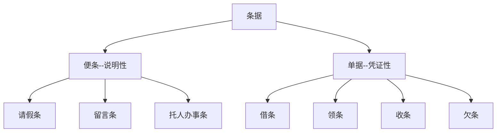
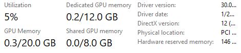

# 一级标题

## 二级标题

### 三级标题

#### 四级标题

##### 五级标题

###### 六级标题

## 普通文本测试

这是一句==没有任何意义==的`废话`，请不要花<u>时间</u>在**阅读**没有*意义*的废话，不要再花 ***时间*** 阅读。

> 这是一句引用自沃·兹基硕德的废话

1. 有序列表测试
2. 有序列表测试

* 无序列表测试

* 无序列表测试

- [ ] 摆烂

| c    |      |      |
| ---- | ---- | ---- |
| 11   | 22   | 33   |
|      |      |      |
|      |      |      |


## LaTex测试

$$
z'_y|_{x=x_0,y=y_0}=f'_y(x_0,y_0)=\dfrac{\partial f(x_0,y_0)}{\partial y}=\dfrac{\partial z}{\partial y}=\lim_{\triangle y\to 0}\dfrac{\triangle_yz}{\triangle y}=\lim_{\triangle y\to 0}\dfrac{f(x_0,y_0+\triangle y)-f(x_0,y_0)}{\triangle y}
$$

行内公式：$x_0处的导数=f'(x_0)=\dfrac{d}{dx}f(x_0)=\lim_{\triangle x\to 0}\dfrac{f(x_0+\triangle x)-f(x_0)}{\triangle x}$ 


## mermaid图测试




## 代码块测试

```c++
#include <iostream>
#include <pthread.h>
#include <unistd.h> //使用Sleep的头

int main()
{
    pthread_t thread1;
    pthread_create(&thread1, NULL, test_thread, NULL);
    char *return_value;
    pthread_join(thread1,(void **)&return_value);
    printf("%s",return_value);
}

void *test_thread(void *)
{
    pthread_exit((void *)"This is a return string\n");
    return NULL;  // 多线程函数必须是void *型的返回值
}
```


## 图片测试


