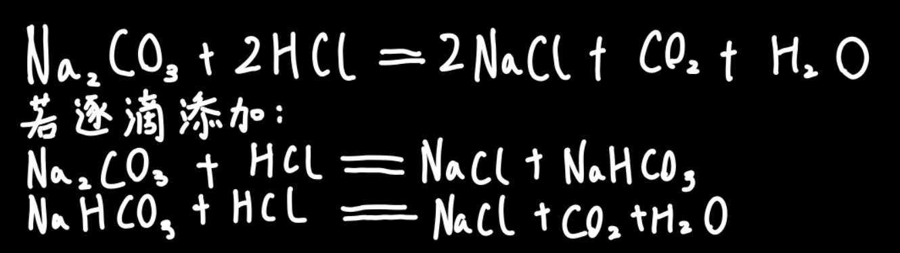
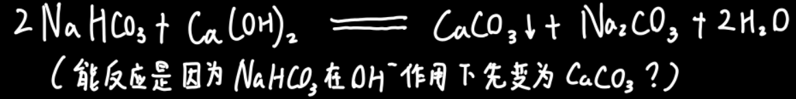
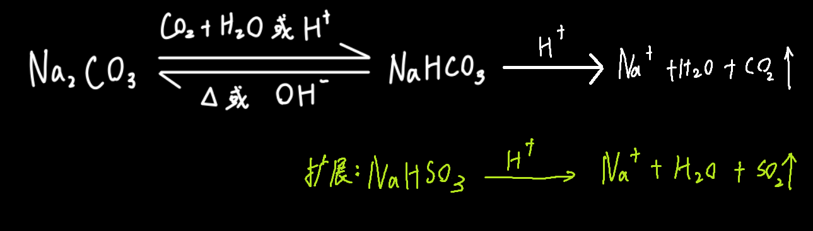

# 碳酸钠与碳酸氢钠

|                  | Na~2~CO~3~                                                   | NaHCO~3~                                                     |
| ---------------- | ------------------------------------------------------------ | ------------------------------------------------------------ |
| 俗名             | 纯碱、苏打                                                   | 小苏打                                                       |
| 颜色状态         | 白色固体                                                     | 白色固体                                                     |
| 用途             | 制造玻璃、造纸、肥皂、纺织                                   | 发酵粉主要成分、治疗胃酸过多、泡沫灭火                       |
| 溶解度           | 能溶于水，==相对大一些==                                     | 能溶于水，==相对小一些==                                     |
| 与`盐酸`反应方程 |  |  |
| 与`盐酸`反应速率 | 慢                                                           | 快                                                           |
| 与`氢氧化钠`反应 | 不反应                                                       |  |
| 与`氢氧化钙`反应 |  |  |
| 与`氯化钙`反应   |  | 不反应                                                       |
| 与`二氧化碳`反应 |  | 不反应                                                       |
| 上述的补充       | 若向饱和的`碳酸钠`溶液中通入`二氧化碳`气体，溶液中会析出白色固体，是因为`碳酸氢钠`的溶解度小于`碳酸钠`的溶解度 |                                                              |
| 热稳定性         | 稳定，受热易分解                                             | 不稳定，受热分解为`碳酸钠`、`二氧化碳`和`水`                 |

# 总结

