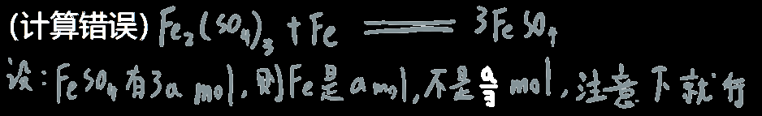
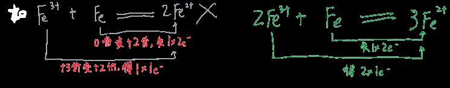

1. 即使有些有毒气体实验包含尾气处理，还是要在通风橱里实验，因为要保险
2. 通过化学方程式计算计量关系时，注意繁分式计算容易出错

3. 计算稀释溶液的题目时注意是要求整体的浓度还是电解质中某一部分的酸根

4. 有关通过气体体积推断物质的量一定要注意是否标明在==标况下==

5. 配置碳酸钠溶液需要的是==无水==碳酸钠，不是n水碳酸钠，然后称量时也应该先进行灼烧、恒重

6. 如果要配置x浓度，450ml的溶液，则计算固体质量时不能按常规逻辑使用450ml计算，而是使用500ml，

   因为实际上没有450ml的容量瓶，只有500ml的

7. 禁止用容量瓶==储存==配置好的溶液

8. 原子团应该被视作是一个==单独的离子==，这就是为什么过氧化钠中的阴阳离子个数比为1:2，

   过氧根应被看做是一个单独的原子团

9. 过氧化钠和氧化钠都会在空气中变质为碳酸钠

   2Na2O2 + 2CO2 == 2CO3 + O2↑ 

   氧化钠先与空气中的水反应变成氢氧化钠，氢氧化钠又会吸收二氧化碳变成碳酸钠

10. 碳酸加速分解：向溶液中加入浓硫酸，碳酸分解生成二氧化碳和水是个可逆反应，浓硫酸可以吸收水分，促使反应正向进行。同时浓硫酸吸水会放热，促进碳酸的分解。

11. 别被题目的文字游戏玩到了

    如：MnO2 + 4HCl(浓） ==加热== MnCl2+ 2H2O + Cl2 ↑

    问：每消耗1molMnO2，其中起还原作用的HCl消耗了几mol？HCl确实起还原作用，但只是==部分==，有4mol参加反应，但只有2mol起还原作用

12. ==Na==入水后产氢氧化钠和氢气

    ==Na2O2==入水后产氢氧化钠和氧气

    2Na2O2＋2H2O===4NaOH＋O2↑

13. 计算混合物的相对平均分子质量可以用混合物的总质量÷每个成分的物质的量和

14. 式量也就是物质的相对分子质量，没有单位，数值上等于摩尔质量，摩尔质量单位为g/mol

15. 想验证溶液中是否含有某种金属离子，最简单的方法就是使用焰色反应

16. 配置溶液时如果想要给溶液贴上标签，则注意浓度保留的==小数点位数==，即精确度

17. 已给相对分子质量，密度，质量分数求溶液物质的量浓度时，别忘了乘上质量分数（易被忽略）

18. 20mL搞清楚是等于0.02L，不是0.2L

19. 将竖直插入反应罐中的直管改为球形漏斗可以起到缓冲，防倒吸的功能

**20. ==☆☆==金属与非金属发生反应时，一定是金属被氧化；金属单质参加化学反应时均呈正价**

21. 活泼金属铝可以但不需要保存在煤油中，因为铝表面会生成一层氧化物膜来防止进一步的氧化

22. 不能用铁粉除去FeCl3中的Cu2+，因为Fe会与Fe3+反应生成Fe2+

23. 稀强碱和弱碱不是一码事

    如：强碱不论浓度都可以把铝氧化成AlO2-，但弱碱只能得到中间产物Al(OH)3

    又如：铝只能把氢氧化钠的氢氧根拿走，拿不走氨水的

24. Fe3+可以被Zn还原为Fe2+，但要注意用量

    **3Zn+Fe2(SO4)3=3ZnSO4+2Fe(足量锌)**

    **Zn+Fe2(SO4)3=2FeSO4+ZnSO4 (少量锌)**

25.   

26. Na2O2不属于中学化学的常见物质

27. ==☆☆==离子方程式书写时不仅要检验元素个数是否守恒，还要检验==电荷是否守恒==

  

28. 在含有亚铁离子的溶液中通入氯气，那亚铁会被氧化为Fe3+

    这个过程可以用KSCN来检验，但值得注意的是：Cl2`不能通入过量`，SCN-会被氯气氧化而失效

29. 双氧水/过氧化氢/H2O2是很强的氧化剂，同时是一种==弱酸==，可以电离出H+

    在酸性环境下：还原产物为H2O，还有一个O给了别的酸根

    在碱性环境下：还原产物为氢氧根

    如碱性环境下6FeSO4 + 3H2O2 == 2Fe2(SO4)3 + 2Fe(OH)3↓，酸性环境则不产沉淀

    离子式：6Fe2+ + 3H2O2 == 4Fe3+ + 2Fe(OH)3↓

30. H2O2分解的化学方程式 2H2O2===2H2O+O2↑。加入适当的催化剂(如二氧化锰)或加热分解更快。

31. 有些实验会利用一个反应产生沉淀的质量来推算其它化学成分的含量，这个时候沉淀是湿的，不好测量，所以需要经过以下四步得到重量：

    **过滤、洗涤、灼烧、冷却至室温、称量**

32. 氯化铁易吸水潮解，还易水解，六水氯化铁/氯化铁溶液受热后会放出**有毒气体氯化氢**

33. ==☆☆==洗气瓶里装着饱和食盐水有什么用：氯气和氯化氢的混合气体通过饱和食盐水,可以吸收氯化氢

    能吸收氯化氢只是因为HCl溶解度很高，选用饱和食盐水而不是纯水是为了防止Cl2也溶到水里根据勒夏特列原理

       

    右边因为是饱和的食盐水，含有很对Cl-，反应逆向发生，从而阻止氯气与水反应

   34. ==☆☆==碱石灰=氧化钙75%+氢氧化钠3%+氢氧化钾1%+水20%，

       可以吸收二氧化碳，二氧化硫（吸收酸性气体），水，氯气（碱石灰里有水），

       可以用来干燥中性气体

35. ==完全==反应和==充分==反应是有区别的

36. `潮解`：固体物质吸收空气中的水分，在其表面形成溶液，属于==物理变化==

    `风化`：在室温和干燥的空气中，结晶水合物失去部分或全部结晶水的过程，属于==化学变化==

37. 盐酸不是强电解质，因为它是混合物，氯化氢才是

38. 不能用==浓==硫酸干燥H~2~S气体，因为会把H~2~S氧化