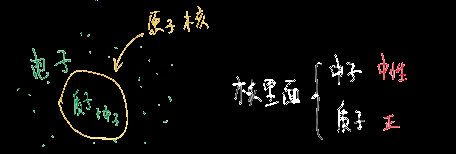
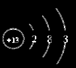
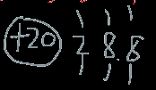
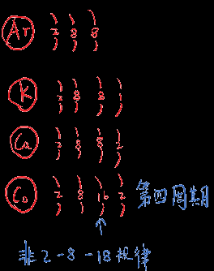
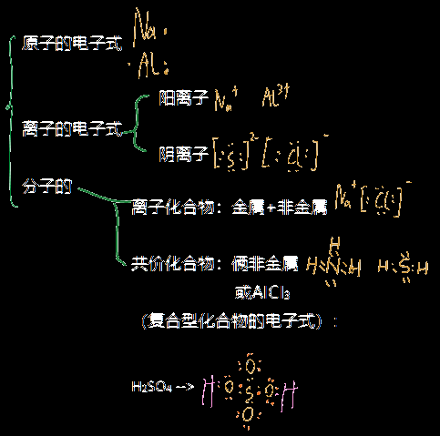

## 注意点：

☆某个原子的相对原子质量实际上是：

这个原子的实际重量÷(碳-12原子的实际重量÷12)

## 原子的基本结构：

A：质量数≈摩尔质量

Z：质子数，当元素处于原子状态时等于原子的==核电荷数==，即电子数，在数值上等于元素周期表的==原子序数==

A-Z：中子数

### 同位素：

定义：质子数相同，中子数不同的==同一元素==的不同核素（可理解为不同原子），物理性质性质不同，化学性质相似

  

## 原子/离子的结构图：

 原子核外电子排布规律：  各电子层最多容纳的电子数为2n^2^

而结构图就是左边画个圈，圈里写原子/离子的正电荷数，右边画像wifi一样的弧线，几个电子层代表几个弧线，对于==短周期元素(1~3)==，可理解为最靠近圆圈的那一层最大为2，第二层最大为8，第三层最大也为8

铝原子结构图：

  

钙__离子__结构图：

  

对于长周期元素，不太符合(?)：

  

##  化学物质的电子式： 

即用小黑点来表示元素原子的最外层上的电子的图式

  

