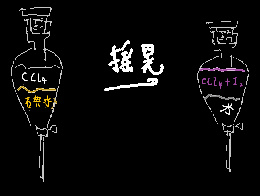

## 定义：

利用溶质在==互不相溶==的溶剂里==溶解度不同==的性质

用一种溶剂把溶质从它与另一种溶剂所组成的溶液中提取出来的方法

所用仪器：分液漏斗

  
  
注意：1.两种溶剂不互溶

​		2.两种溶剂不反应

​		3.溶剂与溶质不反应

！！萃取操作是能使某些物质褪色的，比如溴溶于四氯化碳时能褪色，在水中是棕色的

## 例子：

碘的萃取

碘微溶于水，碘溶液呈现浅黄色

但是易溶于四氯化碳CCl4，(汽油)苯，有机物，酒精

四氯化碳本身无色，加入紫色的碘后会变成紫色的溶液

​       