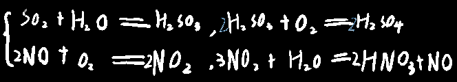

## 1.酸雨（pH<5.6）

  

  
  
## 2.硫

硫为淡黄色晶体

不溶于水，微溶于酒精，易溶于二硫化碳

  
  
铁与硫的反应条件为：先加热，加热后混合物保持红热

而铁与氧气的反应条件为点燃

## 3.硫化氢

1.有刺激性气味

2.比空气重力

3.呈现弱酸性

4.能溶于水

5.呈还原性（硫呈最低价位）

阴离子还原性排行：

  
  
6.具有可燃性

  
  
7.弱电解质（分部弱电离）

  
  
8.需密封保存

  
  
## 4.硫酸

注意：**虽然硫酸是强电解质**

**但浓硫酸中大部分都是以分子形式存在的**

**所以浓硫酸==并不会==使反应速率增加**

#### 工业制硫酸三部曲：

1.沸腾炉

  
  
2.接触室

  
  
3.吸收塔

  
  
FeS2硫化亚铁 Fe2S3硫化铁

注意：酸雨中硫酸的形成方式与上述的不一致

  
  
#### 性质：

##### 1.==高沸点，强酸性==

能用硫酸制得盐酸、硝酸等强酸

##### 2.==吸水性==

能吸取别的物体中的水分子/吸取结晶水合物中的水

##### 3.==脱水性==

能以2:1的比例抽取出物体中的H、O元素

所以遇到有机物后，如糖（碳水化合物）后，会变黑，因为氢氧没了，只剩下碳了

##### 4.==☆☆☆氧化性==

加热时：

能与除Au、Pt以外的一切金属反应，与Fe、Al不产生钝化物

不加热时：

能与Fe、Al等少数活泼金属反应，与Fe、Al产生钝化物

稀硫酸：

产氢气，与变价金属产生低价离子

>  如：稀硫酸与锌的反应能体现硫酸的氧化性

浓硫酸：氧化性增强

不产氢气，生成二氧化硫，与变价金属产生高价离子

##### 5.钝化物

铁的钝化物：四氧化三铁

铝的钝化物：氧化铝