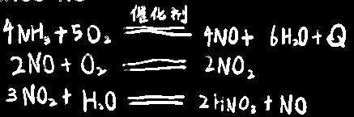
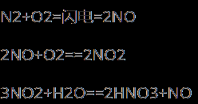
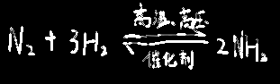
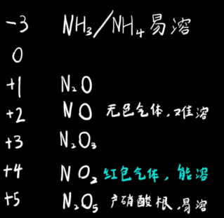
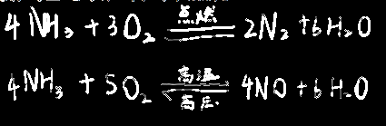

## 硝酸：

硝酸跟金属反应==不产生==氢气！

与大部分金属反应，加热对反应影响不大，本来就是强氧化剂了

金属与稀硝酸反应生成一氧化氮，与浓硝酸生成二氧化氮

>浓硝酸反而产二氧化氮这种被还原程度不高的化合物
>是因为浓硝酸把原本产出的一氧化氮又氧化了

硝酸的酸酐为==N2O5==，不为NO2，因为NO2与水反应还会生成杂质一氧化氮，不属于酸酐

NO2+H2O==HNO3+NO

##### 工业制硝酸（氨气法）：

  

##### （同时，氨气也可用于制其它工业原料）

  

## 固氮：

将大气中的游离态氮转换为氮化合物

氮气中有三个共价键，非常稳定

| 固氮种类 | 细节                                                         |
| -------- | ------------------------------------------------------------ |
| 生物固氮 | 厌氧固氮酶                                                   |
| 大气固氮 |  |
| 工业固氮 | 此反应必须在加压的条件下进行 |

## 含氮氧化物：

警告：**一般化学式前面的呈现正价，氨气为负价**

  

## 铵盐：

所有铵盐遇热都可生成氨气

NH4Cl=△=NH3↑+HCl

NH4HCO3=△=NH3↑+CO2↑+H2O

此特性可以用于1.检验NH4+ 2.制取NH3

 

铵盐也都可以和碱反应，加热条件下可以让生成的氨气释放出来

NH4Cl+NaOH=△=NH3↑+H2O+NaCl

## 氮肥：

##### 尿素(有机氮肥) 

(NH~2~)~2~CO

##### 铵态氮肥

 NH~4~HCO~3~

 NH~4~NO~3~

##### 硝态氮肥

KNO~3~

NH~4~NO~3~

## 氨气

NH3呈弱碱性，易挥发

检验方法：

1.加热后将湿润石蕊试纸置于其上，看颜色是否变蓝

2.用玻璃棒蘸取HCl

  然后将玻璃棒置于盛放氨气的瓶口处，看是否瓶口会产生白烟

NH3+HCl == NH4Cl（固态）

 

氨气也可以在氧气中燃烧

  

