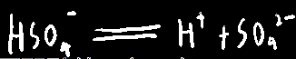

## 易错点：

0. 别把==乙醇==和==乙酸==搞混了，乙醇溶于水不破坏化学键

1. 酸碱中和的**现象**只有放热

2. 大部分盐**都是强电解质**

3. 溶液的导电性与可移动离子数目无关，与可移动离子**浓度**有关

4. 并非只有离子化合物才是电解质，比如盐酸，==共价化合物==

5. pH相同的酸，不论强弱，c(H+)都相同（因为pH描述的就是水中氢离子的浓度）

​	但是如果弱酸中的氢离子因为某些原因消耗掉了一些，溶液的pH仍会==保持不变==，

​	因为弱电解质中大部分酸未完全电离，大部分<u>呈化合态</u>，由于电离平衡，

​	所以一旦电离出的离子被消耗掉了，会从化合物中再电离出一些离子来补充

6. 弱电解质的电离==依靠水的作用==,浓度越大,相对水的含量就少,促进电离的能力就越弱,电离程度就越小

7. ☆氨气是非电解质，但一水合氨是

8. 如果一个盐是强酸强碱/弱酸弱碱盐，那一般情况下不会水解，也就是**呈电中性**

   但是如果还是式盐（如NaHSO4），会有这边==额外的氢离子==，所以==呈酸性==，这个酸性跟**水解无关**

9. 部分金属氧化物和非金属氧化物也是电解质，如CuO，在熔融状态下能导电，还有H~2~O，也能自电离。

## 电解质：

#### 定义：在水溶液/熔融状态下能导电的化合物

固体电解质入水后被水分子作用，形成==水合离子==，详见'3.剖析物质间的能量变化'

让电解质溶于水/融化以让其导电的本质就是：让**其中的离子能自由移动**

#### 易错点：

1. ==混合物==、==单质==（如浓硫酸、稀硫酸、食盐溶液、氯气）不符合电解质定义的物质，属于“<u>既不是电解质也不是非电解质</u>”

2. 上述的概念跟“非电解质”的概念完全同，非电解质在定义上跟电解质相同，只是电解==能力比较差==而已

#### 酸式盐：

可电离出氢离子的盐；或者也可以说是酸中氢离子被部分中和的产物

例：NaHSO~4~

如何制取：

==☆==让弱酸的正盐与对应的弱酸反应

  

多元弱酸酸酐与少量碱（有点牵强）

  

#### 碱式盐：

这种盐电离不仅生成酸根还会生成OH^-^

例：Mg(OH)Cl

#### 正盐：

酸碱完全中和产生的盐，不含H^+^与OH^-^

例：NaSO~4~

## 电离方程式：

**强电解质的电离方程式一般为==单向==箭头；**

**弱电解质的电离方程式一般为==双向==箭头；**

关于分布电离的级数：

其中几元弱酸就要有几级电离方程式（并且是双箭头），如

  

而强酸大多是都是一步电离到位（并且是单箭头），如

  

然后对于弱酸的==酸式盐==，也是跟弱酸一样要分步电离的

（但第一步是单箭头，后面都是双箭头，因为**几乎所有盐都是强电解质**），如

  

对于强酸的酸式盐，则是能一步解离完全（单箭头），如

  

也就是说，强酸的酸式酸根能完全电离，如

  

而弱酸的不行，如

  

## 你这水硬不硬啊

硬水：含有易于形成沉淀的离子的水

软水：含易于形成沉淀的离子不多的水

## 水的自电离

方程式：

  

纯水中氢离子浓度×氢氧根浓度=1×10^-14=水的离子积=K(w)

==升温加速水的自电离==

> 由方程式得出的另一种理解：
>
> 此方程式告诉我们水自电离出1个单位氢氧根时，同时也会电离出一个单位的H+
>
> 如：往水里加0.1mol HClO~4~，这势必影响到了水的正常电离

电解质对水电离的影响，分为几类：

强酸强碱盐不会对水的自电离产生影响，强酸/弱酸/强碱/弱碱/强酸弱碱盐/弱酸强碱盐会对水的自电离产生影响。

