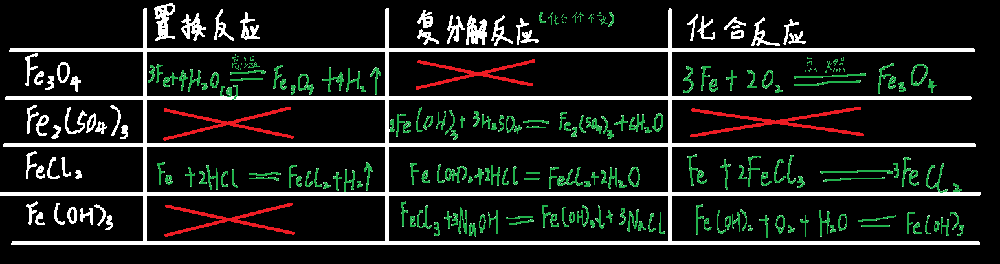

## 1.合金：

合金一般比纯金属硬度高（原子间无法滑动，因为被加进去的大原子卡住了）

但熔沸点更低（本来整齐的原子排列被打乱了，分子间作用力）

  

## 2.铁离子的检验：

三价铁离子会氧化碘离子和亚硫酸根，因此不能与它们共存

| 检验离子 | 颜色 | 加KSCN硫氰化钾                                               | 加NaOH                                                       |
| -------- | ---- | ------------------------------------------------------------ | ------------------------------------------------------------ |
| Fe2+     | 浅绿 | 无现象（通入氯气后变血红）                                   | 产生白色沉淀，一会后变为浅绿色，然后变为红褐色 |
| Fe3+     | 棕黄 | 变为血红色 | 立即变为红褐色                                               |

  

p.s.铁跟硫的反应是：铁在硫蒸气中加热

------

  

3Zn+Fe~2~(SO~4~)~3~=3ZnSO~4~+2Fe(足量锌)

Zn+Fe~2~(SO~4~)~3~=2FeSO~4~+ZnSO~4~ (少量锌)

## 3.常见氧化物：

FeO氧化亚铁，黑色，不稳定，在空气中可直接氧化为Fe2O3，与空气在加热条件下反应除了Fe2O3还会生Fe3O4

Fe~2~O~3~氧化铁，红褐色，赤铁矿化学式

Fe~2~O~3~·H~2~O水合氧化铁，红褐色，铁锈的主要成分

Fe~3~O~4~四氧化三铁，黑色，磁性物质

## 4.常见氢氧化物

2Fe(OH)~3~=Fe~2~O~3~+3H~2~O (反应条件为受热)

Fe(OH)~3~棕色或红褐色，==胶体==，做净水剂

  

Fe(OH)~2~白色

## 5.如何产生铁的常见化合物

  

## 6.高铁酸

铁不仅仅有+2，+3价，还有+6价

氧化性==极强==，与水缓慢反应，最终生成氢氧化铁胶体和氧气

