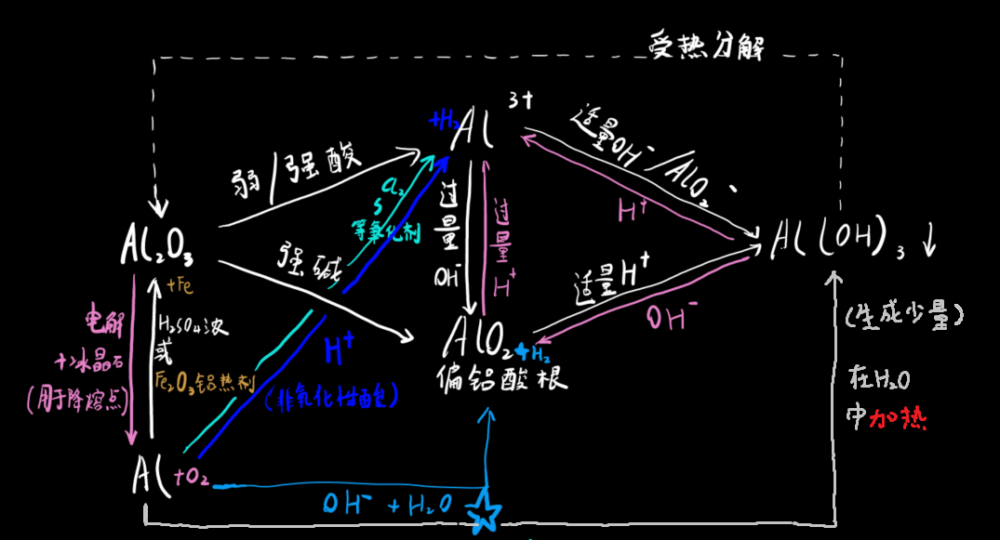
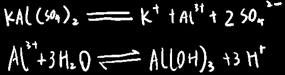

## 易错点：

**稀强碱**和**弱碱**不是一码事

强碱不论浓度都可以把铝氧化成AlO2-，但弱碱只能得到中间产物Al(OH)3

铝只能把氢氧化钠的氢氧根拿走，拿不走氨水的

## 究极总结图：

## 明矾：(十二水硫酸铝钾)

铝盐一定要注意==防水解==，可加酸来防止

  

氢氧化铝低浓度时以胶体形式存在，可以吸附杂质，所以说明矾是净水剂

但氢氧化铝浓度太高了就会有沉淀产生

## 氢氧化铝：（重点双水解）

H+ + AIO2- + H2O <=**碱性环境中酸式电离**=>AI(OH)3 <=**酸性环境中碱式电离**=> AI3+ + 3OH-

