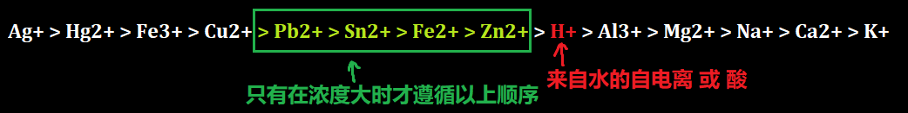
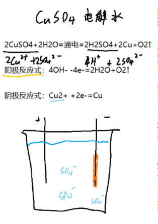
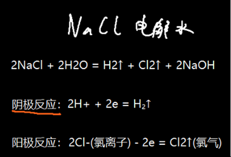
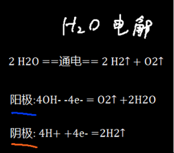

## 阴阳正负

阴阳极是用来描述电解池的，正负极是用来描述原电池的

### 阴极：

得到电子的一极（没有严格要求，能导电就行）

阴极反应依照物质的氧化性，氧化性强的优先接受来自负极的电子

#### 阳极：

失去电子的一极（☆最好为惰性金属，石墨更好）

阳极极柱还原性应比盐溶液中的阴离子弱，不然电极自己会受到溶解

因此电解含氧酸盐溶液时，阳极上是氢氧根电解产生氧气，而酸根本身不参与反应

#### 正极：

电子流入的那一端

#### 负极：

电子流出的那一端

## 反应顺序

阳极：还原性强的物质先失去电子，还原性顺序按照下表

金属(除Au,Pt) > S^2-^ > I^-^ > Br^-^ > Cl^-^ > **OH^-^(来自于水的自电离 或 碱)** > NO~3~^2-^ > SO~4~^2-^ > F^-^

阴极：氧化性强的先得电子，氧化性顺序遵循下表

 

## EG

  

  

  

