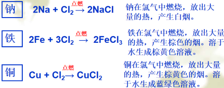
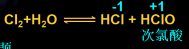
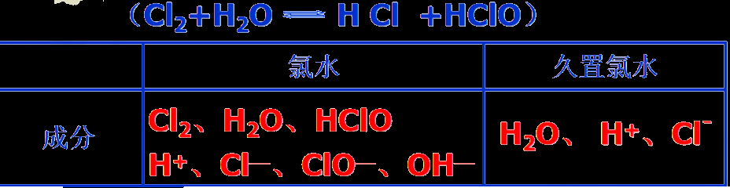
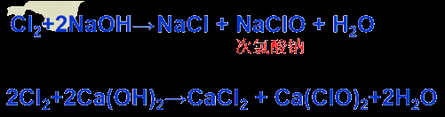

## 注意点：

1. 制取氯气时，为了防止多余的氯气污染环境，可以用氢氧化钙吸收×

   氢氧化钙虽然可以吸收，但是氢氧化钙溶解度太低，吸收不了多少，

   推荐使用氢氧化钠√

2. 氯气的检验：如果使用湿润的石蕊试纸，则接触氯气后会先变红后无色

3. 次氯酸是弱酸，因此写离子方程式的时候不！能！拆分成离子，如次氯酸钙和二氧化碳的反应：$\text{Ca}^{2+}+2\text{ClO}^-+\text{CO}_2+\text{H}_2\text{O}\xrightarrow[]{}\text{CaCO}_3\downarrow+2\text{HClO}$

## 基本性质：

通常情况下，氯气<u>呈黄绿色</u>有刺激性气味，

密度比空气大，<u>能</u>溶于水，1体积水大约能溶解2体积氯气，

易<u>液化</u>，有==毒==。

## 金属能在氯气中燃烧：

​       

氯气很活泼，可以和大多数金属反应，与变价金属(Fe)反应时一般生成高价金属氯化物

## 氯气能与水反应生成次氯酸：

​     

1）弱酸性：酸性比H2CO3还要弱，因为氢离子与氯离子结合的太紧了，导致其称为了弱电解质，也就是弱酸

2）强氧化性：可杀菌、消毒、漂白

3）不稳定性：见光易分解

  

  
  

## 氯气能用于合成实用物质漂粉精：

  
  
工业上用氯气与消石灰（氢氧化钙）反应制备漂粉精用于漂白

漂粉精成分即：氯化钙+次氯酸钙

### 漂白粉漂白的原理是怎样的？

  

### 如果想要加速漂白的话可以加入HCl:

  

Q:为什么漂白常用漂粉精而不直接使用次氯酸？

A:次氯酸易分解

Q:如何保存漂粉精？

A:密封保存，防止接触空气中的水分以及CO2