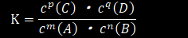
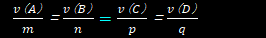
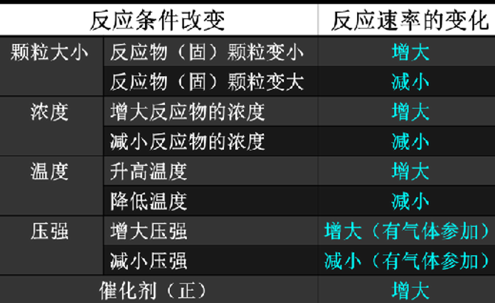
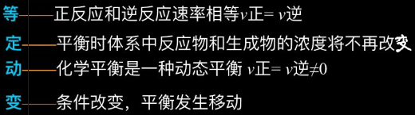
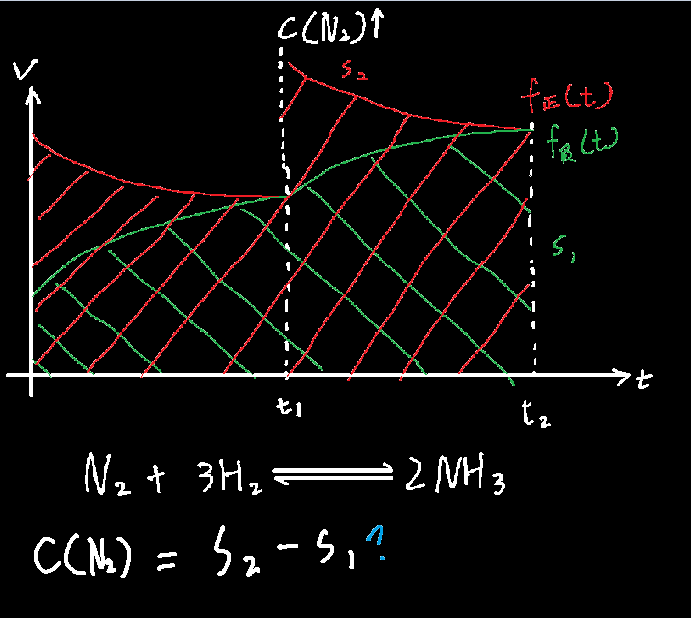
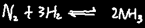
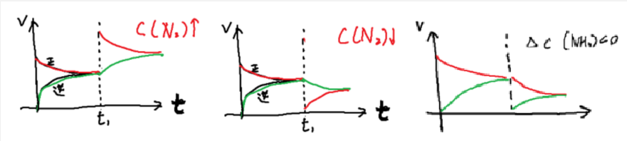

## 化学平衡常数K：

它化学反应速率不是一个东西。==它只随温度而改变==

当mA+nB⇋pC+qD时：

  

## 化学反应速率V：

它代表一段时间内某物质浓度变化的速度。==它随着温度，浓度，压强，催化剂而改变==

当mA+nB⇋pC+qD时：v=△c/△t

 

中间红色等号仅当反应达到平衡时成立

  
  

## 什么化学反应为可逆反应？

产强电解质，不强烈的化学式，为可逆反应，用双等号⇋

产沉淀，或弱电解质的化学式用，为普通反应，等号=

## 化学反应何时达到平衡？

  

  易错点：A的反应速度和C的反应速度相等并不能说明反应达到了平衡，必须要反应速度再==除以系数==还相等

## 勒夏特列原理：

如果改变可逆反应的条件（如浓度、温度等）

化学平衡就会被破坏，并向减弱这种改变的方向移动

> 什么是反应向左移动 = 偏向逆反应
>
> 反应向右移动 = 偏向正反应

## 图解化学平衡：

##### 物质的量浓度图示

  
 

##### 图像表达化学平衡

  
 

  

当看到的条件是关于浓度的，就使用以下法则：

1.看减少（或增加）的物质是属于正反应还是逆反应，然后让题干描述的物质大幅度下降/上升（看浓度改变量是正还是负）

2.让反方向慢慢与其会和