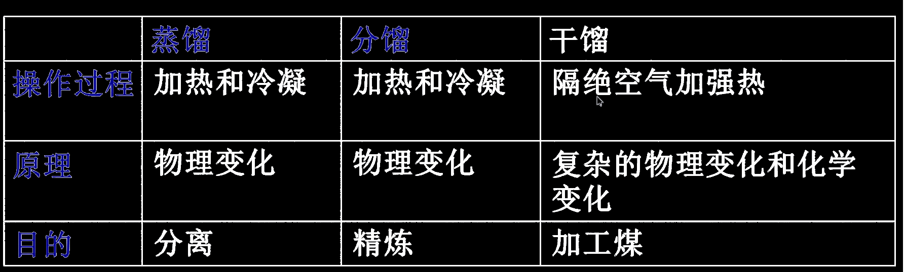
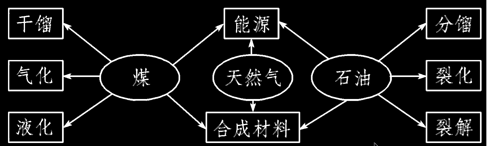

# 煤炭

## 干馏

> 定义：将煤隔绝空气加强热使其分解，是复杂的==物理+化学==变化

可获得：焦炭(高纯度的碳)，煤焦油，粗氨水，粗苯，焦炉气（氢气与甲烷）

  

## 气化

> 定义：将煤转化为可燃性气体的过程

主要反应：

  

煤在氧气气不足时发生部分转化

## 液化

> 直接液化：煤与氢气作用生成液体燃料
> 间接液化：煤气化->催化剂->甲醇

总之是用来产人造石油的

  

