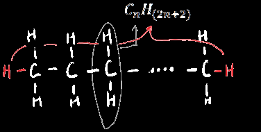
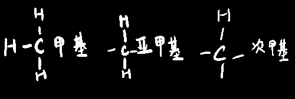
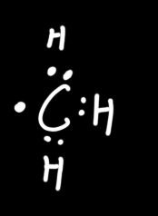
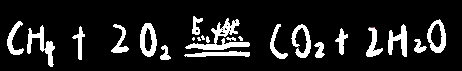
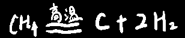
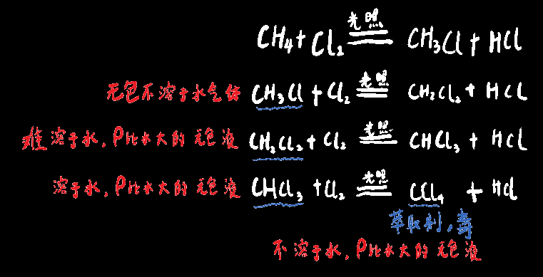

# 烷烃

## 烷烃的基本性质：

烷烃一定是饱和的碳碳单键，且是==链状==的，因此环烷烃不属于烷烃，空间构型为正四面体

烷烃分子中，碳碳均以单键相连接，剩余价键与氢原子相连

烷烃的通用化学式：C~n~H~(2n+2)~

  

若烷烃以取代基形式存在于其他有机化合物中，则称为X基，

> 如甲基(-CH3)、乙基(-CH2CH3)、丙基(-CH2-CH2-CH3)

同时一种烷烃型取代基也可分为X基，亚X基，次X基

> 
  

>
> 

## 经典化学方程式

#### 甲烷的制备：

  

无水醋酸钠和碱石灰混合加热

#### 甲烷燃烧：

  

#### 甲烷分解：

  

#### 卤代反应：

对于烷烃，典型的卤代反应是与氯气反应，对于溴水比较麻烦

> | 饱和烃（烷烃）                     | 不饱和烃（烯烃炔烃）                 |
> | ---------------------------------- | ------------------------------------ |
> | 能与**液溴**反应，不与**溴水**反应 | 不能与**液溴**反应，能与**溴水**反应 |

或者理解为： 取代反应必须和纯卤素,氯水溴水都不可以 

烷烃与氯气反应的化学式：

  

甲烷跟氯气反应是不带顺序的，~~不是所有甲烷都跟氯气反应完生成一氯甲烷，然后再一起进行下一步生成二氯甲烷~~

实际上是就算甲烷和氯气按1:1体积混合，取代产物也不止一氯甲烷，还混合了二氯、三氯甲烷（氯仿）、四氯化碳