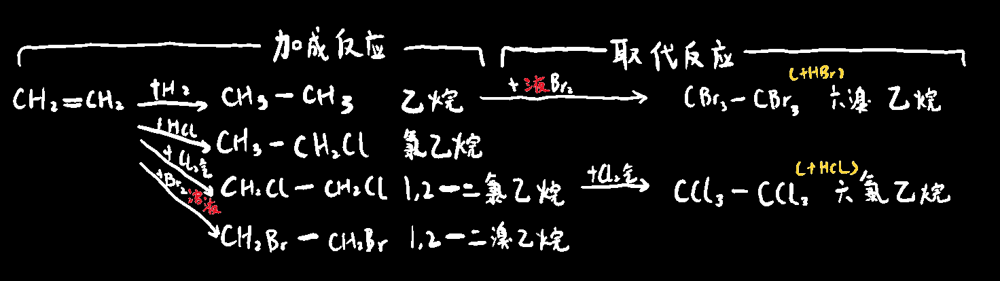
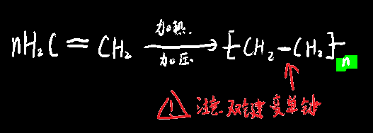

# 烯烃

## 烯烃的基本性质

烯烃属于`不饱和链烃`，且是至少含有一个碳碳双键的烃，通式为C~n~H~2n~，与==环烷烃==的通式相同

> 作用：==催熟剂==、合成纤维，合成橡胶，乙醇的基本原料，因此能反应一个国家的化工工业水平

空间构型：碳原子和氢原子在**同一平面**上，不像烷烃的四面体

不溶于水，溶于有机溶剂，甜味，可燃

乙烯两根键中有一条易断开，导致乙烯==性质活泼==

## 乙烯的加成反应

乙烯能和氢气，氯气，HCL，水，溴溶液发生加成反应

  

## 乙烯的其余化学反应：

燃烧：火焰明亮并伴有==黑烟==（碳原子越多烟越黑）

  

| 待检气体     | Br2(溶于CCl4)      | KMnO2(酸性环境)                              | 点燃                                 |
| ------------ | ------------------ | -------------------------------------------- | ------------------------------------ |
| 甲烷         | 无变化             | 无变化                                       | 淡蓝色火焰                           |
| 乙烯  / 乙炔 | 红棕色褪去（加成） | 紫红色褪去（易被强氧化剂氧化），生成二氧化碳 | 明亮火焰、有黑烟（碳原子越多烟越黑） |

## 乙烯制取相关：

| CH~3~-CH~2~-OH  \==浓硫酸,170℃==>  CH~2~=CH~2~+H~2~O         | CH~2~=CH~2~+H~2~O   \==催化剂,加压,加热==>  CH~3~CH~2~OH |
| ------------------------------------------------------------ | -------------------------------------------------------- |
| 2CH~3~-CH~2~-OH  \==浓硫酸,140℃==>  CH~3~-CH~2~=O=CH~2~-CH~3~+H~2~O <u>取代反应</u>,乙醚 |                                                          |
| 乙烯的实验室制备（工业制备乙烯用石油裂解）                   | 乙烯的水化法制乙醇                                       |
| 消去反应                                                     | ==加成==反应                                             |

注意点：

1. 乙醇 : 浓硫酸=1:3
2. 要先加入乙醇，再缓慢地加入浓硫酸（就跟酸入水法则一样），否则会因为浓硫酸与乙醇稀释时放出的热量而浓硫酸飞溅，产生危险
3. 装有乙醇和浓硫酸烧瓶在加热时要加入几块碎瓷片或玻璃珠防止爆沸
4. 浓硫酸物质的量浓度为18.4mol/L，作用为**脱水剂**和**催化剂**
5. 乙醇具体是要要求==无水==乙醇
6. 加热温度一定要控制在170℃左右，>170℃会产生杂质SO~2~和CO~2~，140℃时生成杂质**乙醚**，但注意产生乙醚时就不是消去反应了，而是==取代反应==

> 为什么170℃产乙烯时为取代反应，而140摄氏度产乙醚时为取代反应？
>
> 生成乙烯时，是**一个乙烯分子**内一个碳上脱去一个羟基，另一个碳原子上脱一个氢原子，得到一个水。
>
> 生成乙醚时，两个乙醇分子脱出一个水，不属于消去反应取代反应

## 乙烯的聚合反应

乙烯经过聚合反应会变为常说的`聚乙烯`，注意`聚乙烯`、或其他聚合物不是纯净物，因为实际上其中每条聚合物的链长是不等的

`聚乙烯`是一种高分子化合物（即式量很大的化合物）

  

聚乙烯70°C时会分解成小颗粒单体

