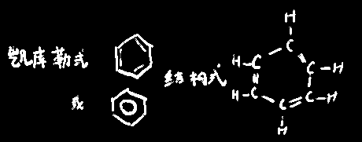
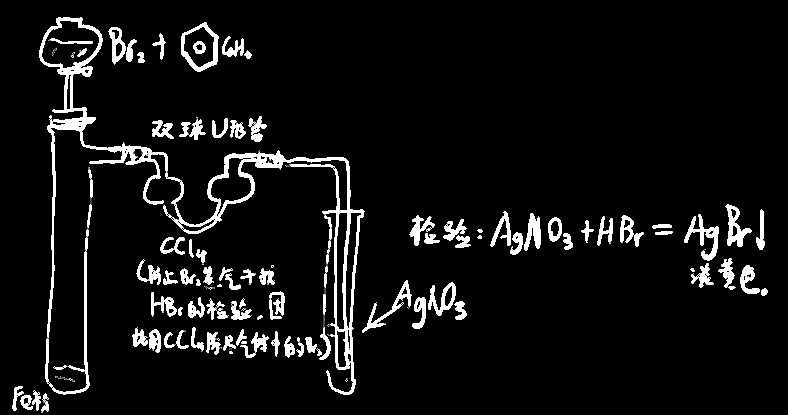
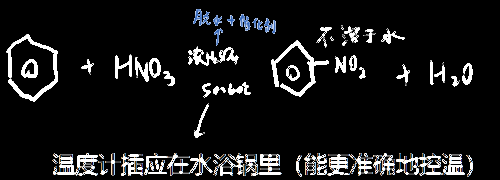
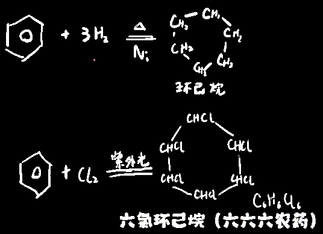
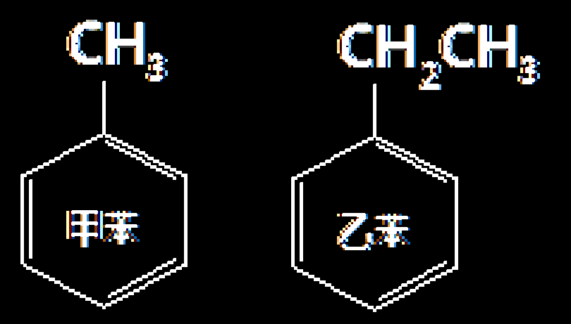
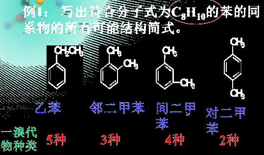
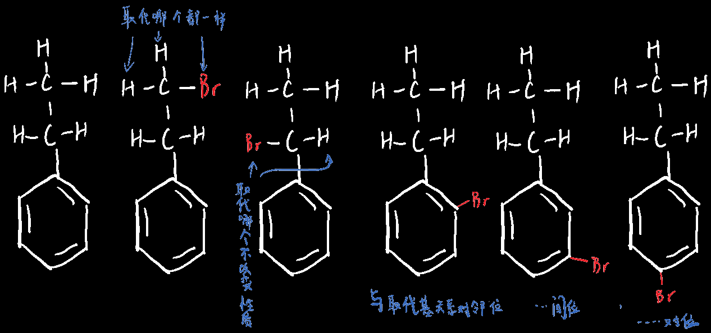

# 苯

## 苯的基本性质

无色，液体，特殊气味（芳香族化合物），不溶于水，密度比水小，有毒，可做==萃取剂==，苯环不属于官能团！

**ρ苯>ρ水>ρ四氯化碳**

> 极性分子溶液易溶于极性分子溶液，非极性分子溶液易溶于非极性分子溶液
>
> 有机溶液易溶于有机溶液，无极物易溶于无机溶液
>
> 极性溶剂：水、乙醇、甘油、丙二醇
>
> 非极性溶剂：苯、氯仿、乙醚、四氯化碳
>
> 另外有机物中亲水基团和憎水基团会影响有机物在水中的溶解性
>
> 亲水基团（含有这些基团的有机物易溶于水）：-OH -CHO -COOH -NH2
>
> 憎水基团（含有这些基团的有机物不易溶于水）：烃基 卤原子 硝基
>
> 故：苯溶于四氯化碳

苯分子的书写：

  

## 苯分子中到底是碳碳什么键？

苯分子中的碳碳键是一种介于单键与双键之间的`独特的键`

因此苯兼有`饱和烃`和`不饱和烃`的性质，稳定性介于饱和和不饱和烃之间

苯难氧化（与酸性高锰酸钾反应不褪色），但可燃（含碳量较高，因此有浓烟），易取代，难加成

------

由于实验证明下面两种`邻二卤取代物`是一种物质，且==键长相等==

  

因此苯的邻位二元取代物只有一种，苯分子中所有的碳键强度是相同的

> （所以凯库勒式其实是错的，但是可以这么写，因为科学家写习惯了）

## 经典化学反应

#### 经典反应①之：溴苯的合成

苯==只能与液溴反应==，不能和溴水反应**苯能萃取溴水，使液溴褪色**

扩展：苯的萃取

| 四氯化碳 | 苯   | 酒精                          | 汽油                              |
| -------- | ---- | ----------------------------- | --------------------------------- |
| √        | √    | ×酒精可溶于水，不能作为萃取剂 | ×有的汽油含有不饱和烃能与溴水反应 |

  

> 铁和液溴反应的化学方程式：==2Fe +3Br~2~——2FeBr~3~==
> 铁和氯气反应的化学方程式：2Fe +3Cl~2~——2FeCl~3~
> 铁和碘单质反应的化学方程式：Fe +I~2~——FeI~2~
>
> 因为苯和溴发生取代的时候需要催化剂，也就是FeBr3，这个催化剂是无法在水溶液中稳定存在的，所以只能临时用铁粉和液溴反应生成

  

！Br~2~易挥发且有毒，反应装置中可用CCl~4~吸收溴蒸汽

！溴也易挥发且有毒

#### 经典反应②之：硝基苯(剧毒)的合成

  

试剂添加顺序：先浓硝酸，再浓硫酸，冷却后加苯

硝基苯不溶于水

> 如何分离苯和硝基苯：蒸馏。（因为苯和硝基苯互溶，但沸点不同）

#### 经典反应③之：环己烷的合成

下述两种反应都为加成反应，并且反应条件都较为苛刻

  

## 苯的同系物

> `苯的同系物`：**一个**苯环上的一个或多个H被==烷基==取代后的烃类产物
> `芳香烃`：含**一个或多个**苯环且只含碳氢（不限定含什么取代基，只要是碳氢就行）
> `芳香族化合物`：含有**一个或多个**苯环，且不只有碳氢
> `苯的同系物`<`芳香烃`<`芳香族化合物`

苯的同系物公式：C~n~H~2n-6~

例：

  

------

取代基会对苯环的活性产生影响

苯也会对取代基产生影响

> 如苯较稳定，不会使酸性高锰酸钾褪色，
>
> 苯环出现取代烷基理论上也不会使酸性高锰酸钾褪色
>
> 但苯环会对侧链产生影响，因此实际上会褪色
>
> 当然侧链也会对苯环产生影响，如甲基使得苯环更易被加成

------

苯的同系物的同分异构体：

例：请写出符合分子式C~8~H~10~的苯的同系物的所有可能结构简式

  

\>\> 为什么乙苯的`一溴代物`有五种？

  
