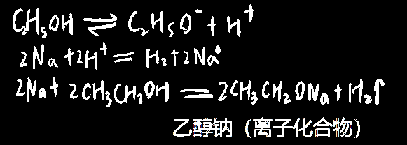
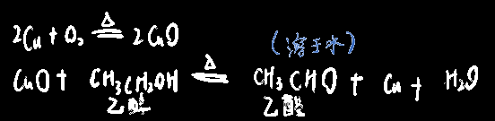

## 乙醇的基本性质

乙醇，俗名酒精，但工业酒精中还含甲醇，会使人中毒，所以不能喝工业酒精

二甲醚（简称甲醚）和它是同分异构体

> 易于燃烧，因此有种加热设施叫酒精灯
> 乙醇燃烧的化学方程式:C2H5OH+3O2=2CO2↑+3H2O

> 丙三醇=甘油，虽说是油，但不溶于水

## 乙醇与钠的反应

钠与乙醇反应，钠**沉于乙醇底部**

乙醇中**羟基上的氢较活泼**，跟碳原子上的氢不一样，

乙醇与钠反应，不叫`取代反应`（**取代原子/原子团**），是`置换反应`（**替换离子**），

乙醇虽然自电离程度很小，但会（还是算非电解质）

  

水中的羟基氢原子活性又比乙醇中羟基中的强很多，（氢氧根带电，羟基不带电）

- [ ] 氢原子活性更强导致更容易被电离？

水不电离时里面是==羟基==，电离了产生的就是==氢氧根==

因此钠与水反应比钠与乙醇反应剧烈。

> 但注意钠与乙酸反应比水反应剧烈，虽然羧基里有羟基，但是乙酸是属于酸的
>
> 反应速度：酸>水>羟基

## 乙醇与乙醛

  

具体现象差不多就是把铜丝烧黑后插入（插入时铜丝留有余温）乙醇中，发现烧黑的部分又回归了铜色

以上两个反应可以合起来写成一个==**氧化反应**==（乙醇为还原剂）

  

同时，氧化产物乙醛是能够变回乙醇的，如下反应是==**加成反应+还原反应**==

  

## 乙醇的其它反应

乙醇可以被酸性高锰酸钾或酸性重铬酸钾直接氧化为乙酸CH3COOH（乙醛被氧化后也是产乙酸，即遇到强氧化剂会直接两步氧化反应合并为一步）