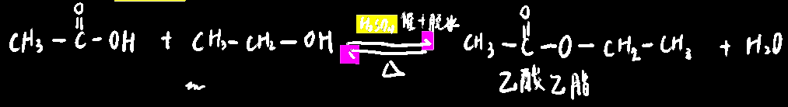
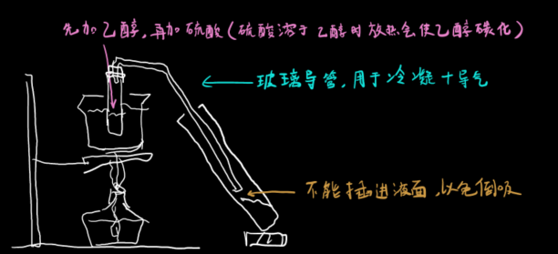
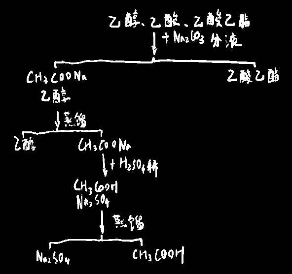
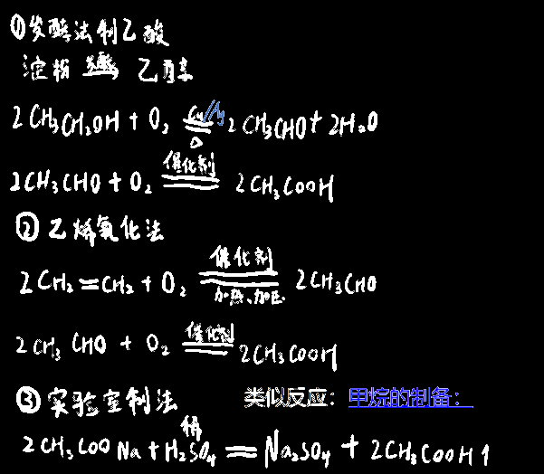

## 乙酸的基本性质

乙酸，又称H~Ac~，易溶于水和乙醇，`无水乙酸`低于16.6°C时会凝结，因此称为`冰醋酸`，易挥发

酸性HCl>H~Ac~>H~2~CO~3~>苯酚

> 苯酚酸性弱到不能和碳酸氢钠反应（碳酸氢钠夺不走苯酚中羟基的H）

## 乙酸的`酯化反应`

`乙酸乙酯`：**不溶于水**，无色透明油状物体，==溶于乙醇==，包含脂基，脂类在碱性条件下水解，产生醇和羧酸盐

脂基：

  

酯化反应<u>属于取代反应</u>，反应时羧酸分子脱去羟基，醇分子脱去氢

 

------

实验装置：

试剂加入顺序依次为：乙醇、浓硫酸、冰乙酸

  

饱和碳酸钠作用：吸收乙醇，中和乙酸，降低乙酸乙酯的溶解度，便于分层

硫酸作用：不仅是催化，还能脱去分子中的水，吸收反应产生的水，降低了生成物浓度，平衡向正反应方向移动，促进合成乙酸乙酯，使产率增加

## 如何分离乙酸、乙醇、乙酸乙酯？

  

## 乙酸的各种制备方式

  

