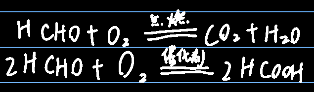

## 乙醛

官能团：醛基-CHO，包含了一个羰基

是无色，易挥发，易燃，有刺激性气味的液体

## 银镜反应

1ml硝酸银溶液+稀氨水，变浑浊，随着稀氨水加入量增多，又变澄清，此时配置得银氨溶液（托伦试剂，==易爆==）

银氨溶液（托伦试剂），其主要成分是氢氧化二氨合银，有弱氧化剂，可以与还原性的乙醛反应

注意点：

1. 试管洁净

2. 要在水浴锅例加热，不能直接加热
3. 加热过程中不能摇晃

## 菲林反应

菲林试剂由氢氧化钠，硫酸铜，酒石酸钠组成，可以用新制氢氧化铜代替菲林试剂

乙醛在加热条件下，能与新制氢氧化铜反应，生成红色沉淀（氧化亚铜沉淀）

因此，菲林反应可用来检验醛基

## 其他反应

可以和酸性高锰酸钾反应，褪色；甲醛能发生氧化反应因为羰基很活泼。

同时，氧化产物乙醛是能够变回乙醇的，如下反应是==**加成反应+还原反应**==

  

## 甲醛

无色，具有强烈刺激性气味的==气体==，40%的甲醛溶液可做福尔马林

结构简式为HCHO，

结构很特别，是平面内的，可看做是两个醛基

和乙醛一样，能与氢气发生加成反应，发生氧化反应，发生银镜反应，也能和新制氢氧化铜反应

其实乙酸中还有一个醛基，可以继续进行反应（不过目前不做讨论）

葡萄糖分子中含有醛基，因此可用斐林试剂检验病人是否患有糖尿病

可以和酸性高锰酸钾反应，褪色，甲醛被氧化为二氧化碳，高锰酸钾被还原为二价锰
