# organic compound

## 有机物化合物的定义

定义为：==碳氢化合物及其**衍生物**==

==碳==元素是构成有机化合物的最基本元素

1. 碳原子通过共价键结合形成的**碳链**或**碳环**构成了绝大多数有机化合物的基本骨架

2. **共价键**是构成有机化合物分子的主要键型

3. 在有机化合物分子中，碳原子总是形成4个共价键

 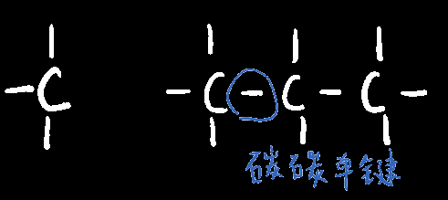 

4. 其中，有机化合物又可分为`链状化合物(脂肪化合物)`和`环状化合物`：

|                | `链状化合物(脂肪化合物)`                                     | `环状化合物`                                         |
| -------------- | ------------------------------------------------------------ | ---------------------------------------------------- |
|                | 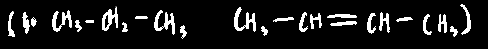 | 又分为`脂环化合物`(eg.环戊烷)；和`芳香化合物`(eg.苯) |
| 只含碳氢时称为 | 脂肪烃                                                       | 脂环烃、芳香烃                                       |

## 有机物与无机物区别

| 类型   | 熔点 | 燃烧情况 | 水溶剂(相似相溶) | 有机溶剂(相似相溶) | 一般化学反应速率 | 副反应 | 种类   |
| ------ | ---- | -------- | ---------------- | ------------------ | ---------------- | ------ | ------ |
| 无机物 | 高   | 难       | 易               | 难                 | 高               | 少     | 几十万 |
| 有机物 | 低   | 易       | 难               | 易                 | 低               | 多     | 几千万 |

## 化学式、键线式、结构式与结构简式

 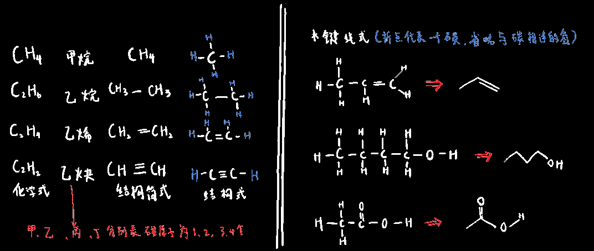 

`化学式`和`分子式(即结构简式)`不是一个东西！

`化学式`可以用于描述离子晶体，原子晶体，或者分子晶体

而`分子式`是专门用于描述分子晶体的，

`化学式`如NaCl只是表达了氯化钠物质中钠原子和氯原子的个数比为1:1

## 官能团

决定有机化合物主要化学性质的基团，有机反应一般发生在==官能团==上

| 有机物类别               | 官能团结构                                                   | 名称                               | 典型代表物                                                   |        |
| ------------------------ | ------------------------------------------------------------ | ---------------------------------- | ------------------------------------------------------------ | ------ |
| 烯烃                     |  | 双键（==一个键活泼，一个键牢固==） |                                                              |        |
| 炔烃                     |  | 三键                               |                                                              |        |
| 卤代烃                   |  | 卤原子                             | 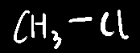 | 氯甲烷 |
| 醇                       |  | 羟qiang基                          | 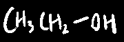 | 乙醇   |
| 酚（直接连在苯环上的羟） |  | 羟qiang基                          | 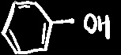 | 苯酚   |
| 醚                       | 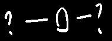 | 醚mi键                             | 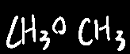 | 甲醚   |
| 醛                       | 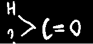 | 醛quan基                           | 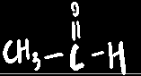 | 乙醛   |
| 酮                       | 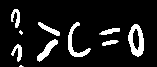 | 羰tang基                           |                                                              | 丙酮   |
| 羧酸(带羧基的一般酸性)   | 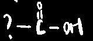 | 羧suo基                            | 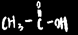 | 乙酸   |
| 胺                       | 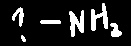 | 氨基                               | 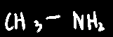 | 甲胺   |

注意：

1. 虽然羧基里可以"**看到**"羰基、羟基，但是如果仅含羧基的有机物是不能说包含羰基和羟基的

 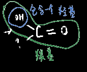 

2. 苯环不属于官能团！