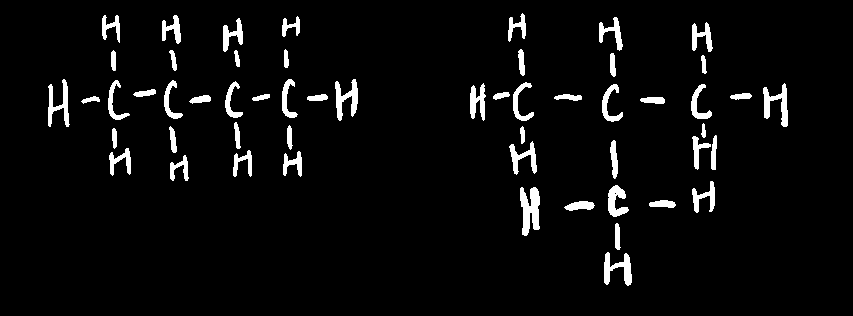
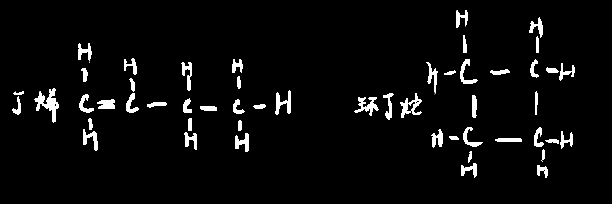
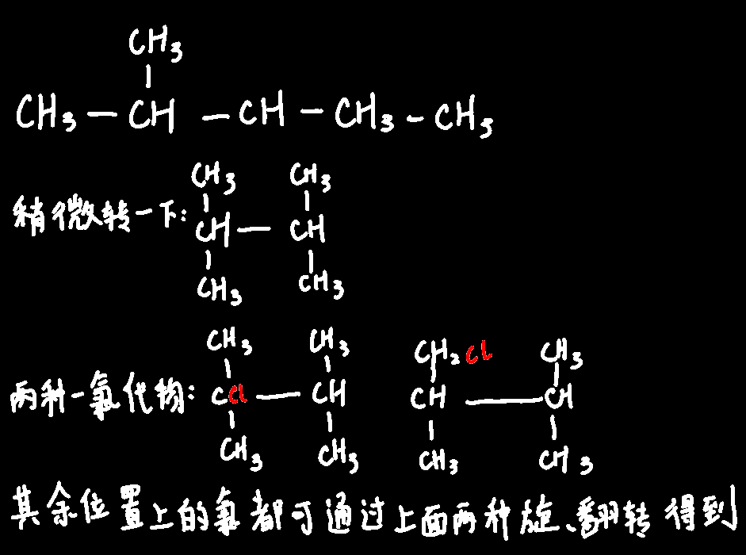

## 同系物

符合同一通式，组成上相差1个或若干个1个或若干个CH2原子团、结构相似的一系列化合物称为同系物

==化学性质相似，物理性质不同==

## 同分异构体

即**分子式**相同但结构不同的两种分子互为同分异构体

如下：

左侧为正丁烷，右侧为异丁烷

  

------

左侧为乙醇，右侧为乙醚

CH3-COOH    CH3-CH2=O=CH2-CH3

------

左侧为丁烯 右侧为环丁烷

  

## 烃的衍生物

概念：

烃分子中的氢原子被其它原子或原子团所取代的一系列化合物

注意这个原子团不能是甲基乙基这种只含碳氢的

易错点：

烃的衍生物**一定**含有官能团

含碳氢氧三种元素的化合物**不一定**是烃的衍生物，如碳酸

注意苯也是属于烃的，因此溴苯**属于**烃的衍生物

## 不饱和/饱和烃

`烃`：==仅含碳和氢==的有机分子，因此什么烷烃烯烃炔烃==苯==都是**烃的子类**，因此肯定都是只含有碳和氢的有机分子

`饱和烃`：  不含碳碳双键或碳碳三键的烃，因此不易发生加成反应

`不饱和烃`：链烃分子中所含氢原子个数比同碳原子的烷烃少的烃，或者说是含碳碳双键或碳碳三键的烃 

## 取代反应

有机物分子中某些原子或原子团被其它原子或原子团替代的反应

甲烷分子中H被Cl代替的反应称为卤代反应

问：下列物质的一氯代物有几种？

## 加成反应

原本有机物分子里不饱和碳原子加入了其他原子或基团，生成更饱和的产物

## 消去反应

==一个==有机物分子里脱去小分子（如水）后生成**不饱和有机物**的反应。

