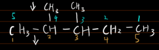
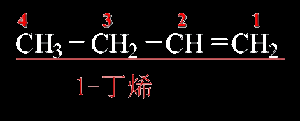
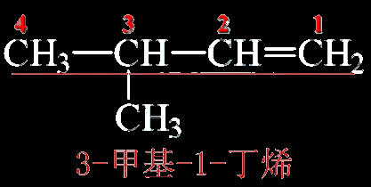
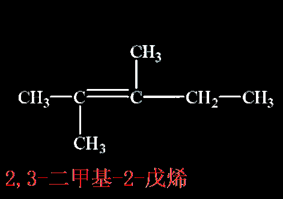
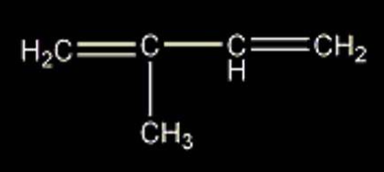

## 烷烃命名

> **“取代基编号代数和要达到最小”**

错误命名规则：

3,4-二甲基戊烷（因为表述这种物质有一种更简洁的写法）

  

为何不写成2,3-二甲基戊烷？

## 烯烃命名

含有双键的最长碳链作为主链，从靠近双键的一段开始给主链原子编号，并用数字标出双键位置

例：

  

  

  

* 2-甲基-1,3丁二烯

## 炔烃命名

含有三键的最长碳链作为主链，从靠近三键的一段开始给主链原子编号，并用数字标出三键位置

例：

CH~3~-C≡C-CH(CH~3~)CH~3~

4-甲基-2-戊炔

