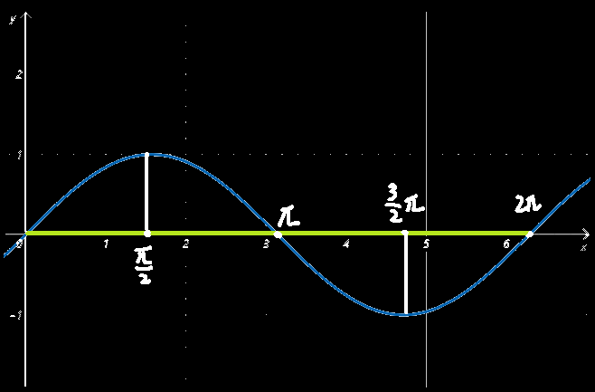

# 三角函数-图像

## 正弦函数

$$
y=A\sin \left( \omega x+\varphi \right)
$$

  

> A——振幅，即波的最高处为A，最低处为-A
>
> ω——周期长度T=2π/ω，即ω越大，波越密集，完整地一上一下称之为一个周期，即上图绿色部分
>
> ​			同时，当ω为负时，需要沿x轴翻转图像
>
> φ ——初始相位，应将图像沿着x轴左右平移，平移φ/ω单位长度，φ/ω为==正向左平移，为负向右平移==
>
> f——频率，等于1/T

原生的sin(x)为奇函数

注意值域为-A==≤==y==≤==A，用的是小于等于号

## 余弦函数

  

默认图像可以记一下，其余其实跟正弦函数时同理的

因为cos(x)根据诱导公式可以转换为sin(-x+π/2)，也就是ω=-1，φ=π/2的正弦函数，

即把sin(x)的图像沿x轴方向翻转一下，然后往右移动π/2个单位长度

> 之后我发现好像cos(x)=sin(-x+π/2)=sin(x+π/2)，所以不用像上图一样解释的那么复杂，就是sin(x)往左移π/2即可得到cos(x)