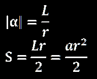
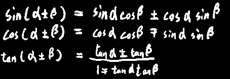
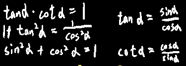
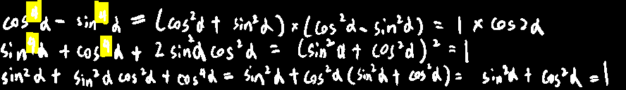
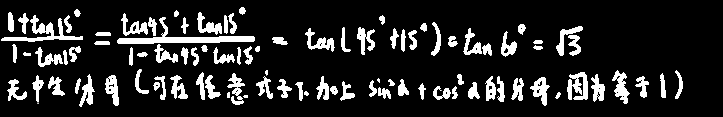
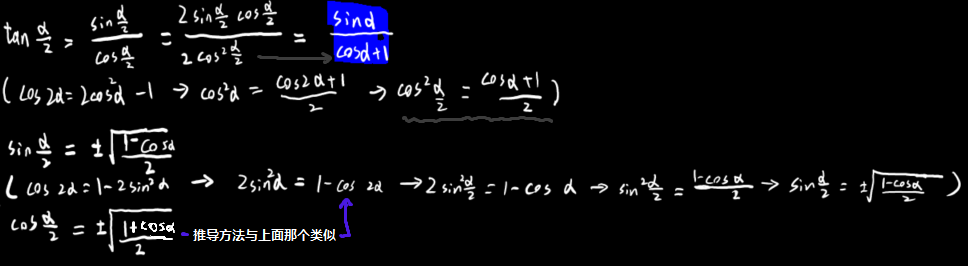

# 三角函数-基本

## 弧度基本计算

  

## 三角函数基本加减

sec(x)=1/cos(x)

csc(x)=1/sin(x)

## 三角函数基本变换

  

## 高次三角函数

  

## 无中生有大法好

  

## 二倍角

$$
\sin 2\alpha =2\sin \alpha \cos \alpha ,\ \left( \sin \alpha =2\sin \frac{\alpha}{2}\cos \frac{\alpha}{2} \right)
$$
$$
\cos 2\alpha =2\cos ^2\alpha -1=1-2\sin ^2\alpha =\cos ^2\alpha -\sin ^2\alpha\\
☆这个公式可用于把普通的三角函数转化为三角函数的平方\\
1+\sin2a=\sin^2a+2\sin a\cos a+\cos^2a=(\sin a+\cos a)^2也可用于升
$$
$$
\tan 2\alpha =\frac{2\tan \alpha}{1-\tan ^2\alpha}
$$

## 单倍角

(等号只是单纯的描述几种转换方式，不是递等式，没有在表达推导过程)
$$
\sin \left( \alpha \right) =\pm \sqrt{1-\cos ^2\alpha}=\pm \sqrt{\frac{1-\cos 2\alpha}{2}}=2\sin \frac{\alpha}{2}\cos \frac{\alpha}{2}
$$

$$
\cos \alpha =\cos ^2\frac{\alpha}{2}-\sin ^2\frac{\alpha}{2}=\pm \sqrt{\frac{1-\sin 2\alpha}{2}}
$$

------

> 对sinα第二个等号的推导：
> $$
> \cos 2\alpha =1-2\sin ^2\alpha
> $$
> 
> $$
> 2\sin ^2\alpha =1-\cos 2\alpha 
> $$
> 
> $$
> \sin ^2\alpha =\frac{1-\cos 2\alpha}{2}
> $$
> 
> $$
> \sin \alpha =\pm \sqrt{\frac{1-\cos 2\alpha}{2}}
> $$
> 

## 半倍角

> 括号内的为推导过程

  

