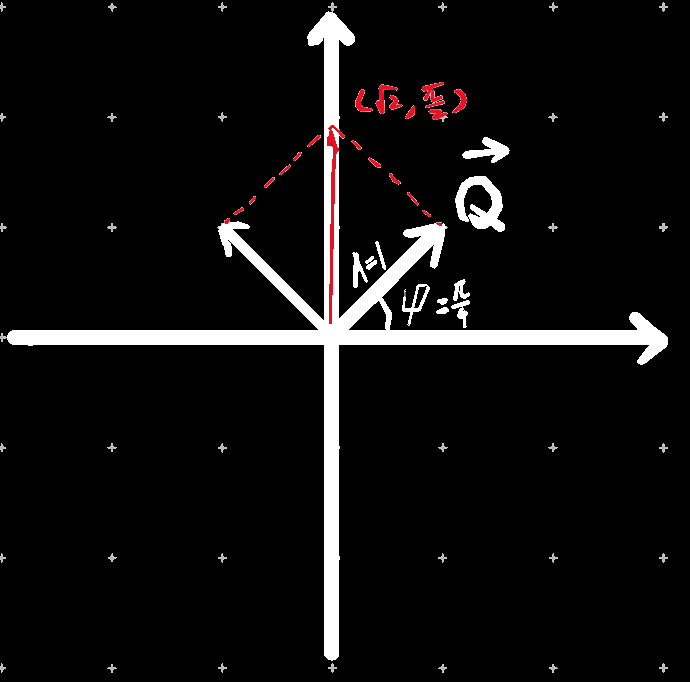

***注：A~1~、A~2~、φ~1~、φ~2~皆为常量，x为自变量***

## 极坐标转换
极坐标系中的一个**点**转换为笛卡尔坐标系中的一个**点**

（单位长度不变的情况下将笛卡尔坐标系的点映射在极坐标系中）

| 笛卡尔坐标系        | 极坐标系                     |
| ------------------- | ---------------------------- |
| （Acos(φ), Asin(φ)) | (A, φ)                       |
| (x, y)              | (√(x^2^+y^2^), tan^-1^(x/y)) |

## 代数方法合并两个角频率相同的三角函数

$$
A_1\sin(\omega x+\phi_1)+A_2\sin(\omega x+\phi_2)\\
=A_1\sin \omega x\cos \phi_1+A_1\cos \omega x\sin \phi_1+A_2\sin \omega x\cos \phi_2+A_2\cos \omega x\sin \phi_2\\
=(A_1\cos\phi_1)\sin \omega x+(A_1\sin\phi_1)\cos \omega x+(A_2\cos\phi_2)\sin \omega x+(A_2\sin\phi_2)\cos \omega x\\
=(A_1\cos\phi_1+A_2\cos\phi_2)\sin \omega x+(A_1\sin\phi_1+A_2\sin\phi_2)\cos \omega x\\
设a=\sqrt{(A_1\cos\phi_1+A_2\cos\phi_2)^2+(A_1\sin\phi_1+A_2\sin\phi_2)^2}\\
原式=a(\dfrac{A_1\cos\phi_1+A_2\cos\phi_2}{a}\sin\omega  x+\dfrac{A_1\sin\phi_1+A_2\sin\phi_2}{a}\cos\omega  x)\\
=a\sin(\omega x+\arccos(\dfrac{A_1\cos\phi_1+A_2\cos\phi_2}{a}))\\
=\sqrt{(A_1\cos\phi_1+A_2\cos\phi_2)^2+(A_1\sin\phi_1+A_2\sin\phi_2)^2}\sin(\omega x+\arccos(\dfrac{A_1\cos\phi_1+A_2\cos\phi_2}{a}))\\
$$

## 几何方法合并两个角频率相同的三角函数

$$
设有一个向量\vec{a}，它的平面直角坐标系坐标为(A_1\cos(\omega x+\phi_1),A_1\sin(\omega x+\phi_1))\\
根据平面直角坐标系坐标可得：A_1\sin(\omega x+\phi_1)的值等于向量\vec{a}在y轴上的数量投影\\
\#既然这个向量只有y轴坐标发挥了作用，那我x轴为什么不随便取个数？答:因为x设置为这样能更方便地转为极坐标形式\\
\left< \vec{a},\vec{i} \right>=\arctan\left(\dfrac{A_1\sin(\omega x+\phi_1)}{A_1\cos(\omega x+\phi_1)}\right)=\arctan\left(\dfrac{\sin(\omega x+\phi_1)}{\cos(\omega x+\phi_1)}\right)
=\arctan(\tan(\omega x+\phi_1))=x+\phi_1\\
|\vec a|=\sqrt{(A_1\cos(\omega x+\phi_1))^2+(A_1\sin(\omega x+\phi_1))^2}=\sqrt{A_1^2\cdot(\cos^2(\omega x+\phi_1)+\sin^2(\omega x+\phi_1))}=\sqrt{A_1^2}=A_1\\
由上可得\vec a的极坐标系坐标为(A_1,\omega x+\phi_1)\\
故证明得：A_1\sin(\omega x+\phi_1)的值等于极坐标向量\vec{a}(A_1,\omega x+\phi_1)在y轴上的数量投影
$$

------

$$
设有一个向量\vec{b}，它的平面直角坐标系坐标为(A_2\cos(\omega x+\phi_2),A_1\sin(\omega x+\phi_2))\\
A_2\sin(\omega x+\phi_2)的值等于向量\vec{b}在y轴上的数量投影\\
同理得\vec b的极坐标系坐标为(A_2,x+\phi_2)\\
再设\vec{c}=\vec{a}+\vec{b}\\
则\vec{c}=(A_1\cos(\omega x+\phi_1)+A_2\cos(\omega x+\phi_2),A_1\sin(\omega x+\phi_1)+A_2\sin(\omega x+\phi_2))\\
∵\vec c在y轴上的数量投影等于A_1\sin(\omega x+\phi_1)+A_2\sin(\omega x+\phi_2)\\
-------\\
故证明得：A_1\sin(\omega x+\phi_1)+A_2\sin(\omega x+\phi_2)=\\
\#极坐标向量(A_1,\omega x+\phi_1)+(A_2,\omega x+\phi_2)在y轴上的投影=\\
\#平面直角坐标系向量(A_1\cos(\omega x+\phi_1)+A_2\cos(\omega x+\phi_2),A_1\sin(\omega x+\phi_1)+A_2\sin(\omega x+\phi_2))在y轴上的投影
$$

## eg

假如要计算sin(x+3π/4)+sin(x+π/4)，可转换为向量Q(1,π/4)+向量Q'(1,3π/4)

这边计算可以用平行四边形法则计算，也可以用化成普通直角坐标系里的向量计算（见三角函数-极坐标系）

计算得到和向量为(√2,π/2)

即sin(x+3π/4)+sin(x+π/4)=√(2)sin(x+π/2)，与带入上方`代数方法合并两个角频率相同的三角函数`的公式化简出的结果是一样的

>  注意这里的有序数对不代表横纵坐标，代表极坐标对(r,θ)
