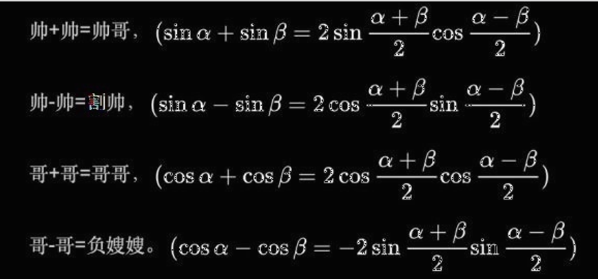

# 三角函数-积与和差

## 积化和差

$$
①\sin \left( \alpha +\beta \right) =\sin \alpha \cos \beta +\cos \alpha \sin \beta
$$
$$
②\sin \left( \alpha -\beta \right) =\sin \alpha \cos \beta -\cos \alpha \sin \beta
$$
$$
③\cos \left( \alpha +\beta \right) =\cos \alpha \cos \beta -\sin \alpha \sin \beta 
$$
$$
④\cos \left( \alpha -\beta \right) =\cos \alpha \cos \beta +\sin \alpha \sin \beta 
$$
$$
①+②\text{，可得2}\sin \alpha \cos \beta =\sin \left( \alpha +\beta \right) +\sin \left( \alpha -\beta \right) 
$$
$$
⑤\sin \alpha \cos \beta =\frac{\sin \left( \alpha +\beta \right) +\sin \left( \alpha -\beta \right)}{2}
$$
$$
①-②\text{，可得2}\cos \alpha \sin \beta =\sin \left( \alpha +\beta \right) -\sin \left( \alpha -\beta \right) 
$$
$$
⑥\cos \alpha \sin \beta =\frac{\sin \left( \alpha +\beta \right) -\sin \left( \alpha -\beta \right)}{2}
$$
$$
③+④\text{，可得2}\cos \alpha \cos \beta =\cos \left( \alpha +\beta \right) +\cos \left( \alpha -\beta \right) 
$$
$$
⑦\cos \alpha \cos \beta =\frac{\cos \left( \alpha +\beta \right) +\cos \left( \alpha -\beta \right)}{2}
$$
$$
③-④\text{，可得2}\cos \alpha \cos \beta =\cos \left( \alpha +\beta \right) +\cos \left( \alpha -\beta \right) 
$$
$$
⑧\sin \alpha \sin \beta =\frac{\cos \left( \alpha -\beta \right) -\cos \left( \alpha +\beta \right)}{2}
$$

## 和差化积
$$
\text{设}x=\alpha +\beta ,\ y=\alpha -\beta
$$
$$
∴\alpha =x-\beta ,\ \alpha =y+\beta 
$$
$$
x-\beta =y+\beta 
$$
$$
\beta =\frac{x-y}{2}
$$
$$
\text{同理，}\alpha =\frac{x+y}{2}
$$
$$
\text{若带入}⑧\text{中，可得}\sin \frac{x+y}{2}\sin \frac{x-y}{2}=\frac{\cos y-\cos x}{2}
$$
$$
\text{即}\cos y-\cos x=2\sin \frac{x+y}{2}\sin \frac{x-y}{2}
$$
$$
\cos x-\cos y=-2\sin \frac{x+y}{2}\sin \frac{x-y}{2}
$$
$$
\text{其余同理}
$$

 

