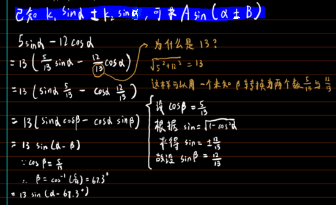
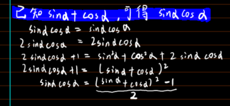
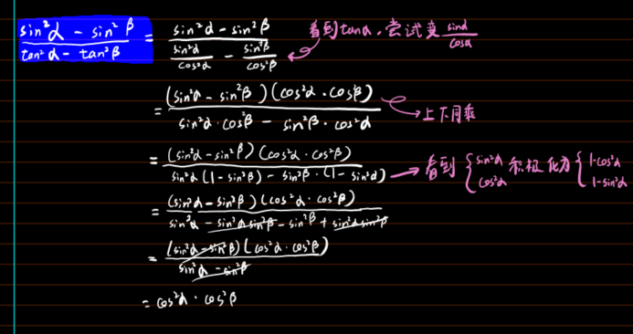
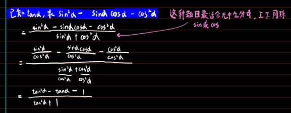
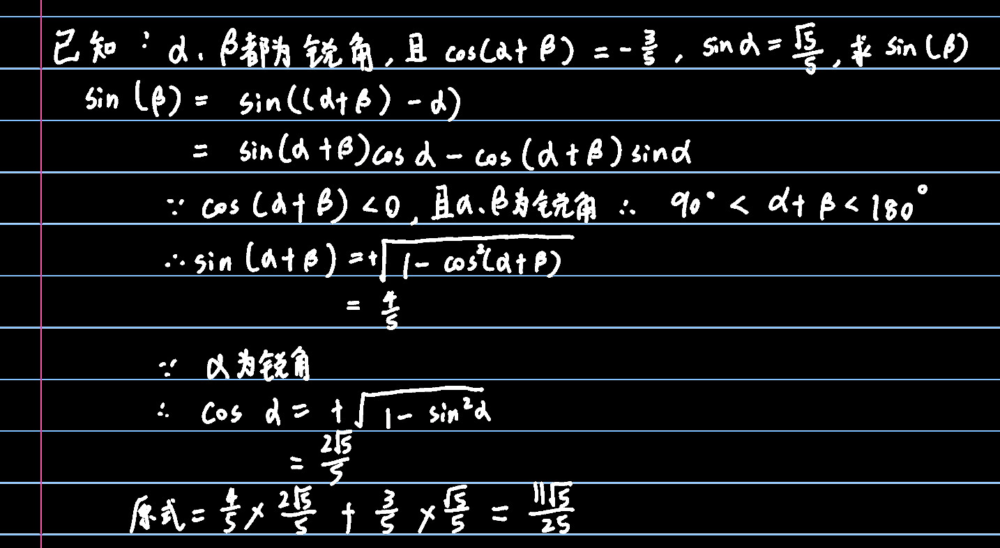

# 三角函数-经典例题

## 规律总结

$$
\text{看到}\tan \alpha →\text{可变}\frac{\sin \alpha}{\cos \alpha}
$$
$$
\text{看到}\tan ^2\alpha →\text{可变}\frac{\sin ^2\alpha}{\cos ^2\alpha}\text{或}\frac{1}{\cos ^2\alpha}-1
$$
$$
\text{看到}\sin ^2\alpha →\text{积极化为}1-\cos ^2\alpha 
$$
$$
\text{看到}\cos ^2\alpha →\text{积极化为}1-\sin ^2\alpha 
$$
$$
\text{一个充满}\sin \alpha \text{与}\cos \alpha \text{的分式，欲求}\tan \alpha →\text{上下同除}\sin \alpha \text{或}\cos \alpha
$$
$$
\text{任意三角函数}\left( \alpha \right) →\text{任意三角函数}\left( 2\times \frac{\alpha}{2} \right) \ \text{或 任意三角函数}\left( \left( \alpha +\boldsymbol{\beta } \right) -\boldsymbol{\beta } \right)
$$
$$
\text{看到}1±\sin 2\alpha \text{或}1±2\sin \alpha \cos \alpha →\text{可转为}\left( \sin \alpha ±\cos \alpha \right) ^2
$$

$$
如上性质可用于解决如\sqrt{1+\sin(某角度)}或\sqrt{1-\sin(某角度)}的问题\\，因为变成平方以后就能把根号消掉了（也可使用2\sin^2a=1-\cos2a）
$$

$$
看到\sin(\alpha)\times \cos(\alpha)两个同角度\sin和\cos相乘，可使用\sin(\alpha)\cos(\alpha)=\dfrac{1}{2}\sin(2\alpha)
$$

## eg1

  

这个可以用来简化复合三角函数，如下
$$
y=2\sqrt{3}\sin x-2\cos x+6
$$
$$
可简化为： y=4\sin \left( x-\frac{\pi}{6} \right) +6
$$

## eg2

  

## eg3

  

## eg4

  

## eg5

