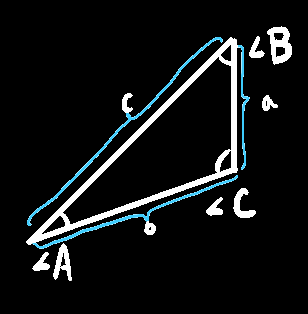
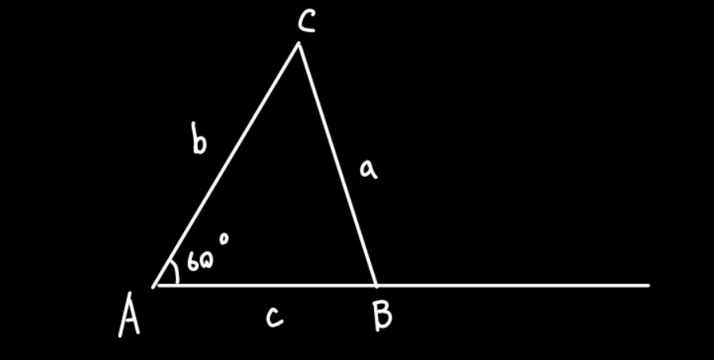
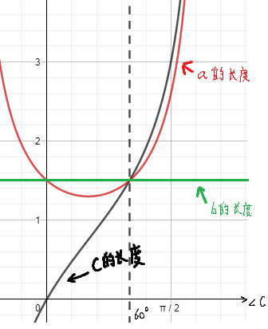

# 三角形中的三角函数

## 常用公式：

在△ABC中：

  

$$
S_{△ABC}=\frac{\text{ab}\cdot \sin C}{2}=\frac{ac\cdot \sin B}{2}=\frac{bc\cdot \sin A}{2}
$$
$$
\frac{a}{\sin A}=\frac{b}{\sin B}=\frac{c}{\sin C}=2R\left( \text{可视作是某种缓冲} \right) 
$$
$$
③\cos A=\frac{b^2+c^2-a^2}{2bc},\ \cos B=\frac{c^2+a^2-b^2}{2ac},\ \cos C=\frac{a^2+b^2-c^2}{2ab}
$$
$$
a^2=b^2+c^2-2bc\cos A,\ b^2=a^2+c^2-2ac\cos B,\ c^2=b^2+a^2-2ab\cos C
$$

$$
最最重要的：A+B+C=180\degree，虽然很傻，但是在解三角形的题目中一定不能忘记这条，\\
可以结合它写方程，或者已知两角求第三角
$$

已知: 三角形三条边，欲求角可以使用定理③（如果只需要知道这个角是钝角还是锐角只需要算出cosθ为正还是负就行，正则肯定是锐角，负则是钝角）

## 一个结论：

#### 一个含60°内角的三角形，60°内角所对的边的长度一定介于另外两边之间

证明：设△ABC，已知∠A=60°，AC长度为`常数`b

$$
\because \dfrac{a}{\sin A}=\dfrac{b}{\sin B}=\dfrac{c}{\sin C}\\
\therefore a=\dfrac{\sin A\times b}{\sin B}=\dfrac{\sin 60\degree\times b}{\sin(180\degree-60\degree-\ang C)}=\dfrac{\sin 60\degree\times b}{\sin(120\degree-\ang C)}=\dfrac{\sin 60\degree\times b}{\sin(180\degree-(60\degree+\ang C))}=\dfrac{\sin 60\degree\times b}{\sin(\ang C+60\degree)}\\
=\dfrac{\sqrt 3\times b}{2\sin(\ang C+60\degree)}\\
\therefore c=\dfrac{\sin\ang C\times b}{\sin B}=\dfrac{\sin\ang C\times b}{\sin(180\degree-60\degree-\ang C)}=\dfrac{\sin\ang C\times b}{\sin(\ang C+60\degree)}\\
=\dfrac{\sin \ang C\times b}{\sin(\ang C+60\degree)}
$$

------

$$
当0<\ang C<60\degree时\\
\dfrac{\sqrt3}{2}<\sin(60\degree+\ang C)<1\\
\sqrt3<2\sin(60\degree+\ang C)<2\\
\dfrac{1}{\sqrt3}>\dfrac{1}{2\sin(60\degree+\ang C)}>\dfrac12\\
b>\dfrac{\sqrt3 b}{2\sin(60\degree+\ang C)}>\dfrac{\sqrt3b}2\\
\therefore a<b\\
a-c\\
=\dfrac{\sin 60\degree\times b}{\sin(60\degree+\ang C)}-\dfrac{\sin \ang C\times b}{\sin(60\degree+\ang C)}\\
=\dfrac{(\sin 60\degree-\sin\ang C) \times b}{\sin(60\degree+\ang C)}\\
=\dfrac{(\dfrac{\sqrt3}{2}-\sin\ang C) \times b}{\sin(60\degree+\ang C)}\\
0<\sin\ang C<\dfrac{\sqrt3}{2}\\
0>-\sin\ang C>-\dfrac{\sqrt3}{2}\\
\dfrac{\sqrt3}{2}>\dfrac{\sqrt3}{2}-\sin\ang C>0\\
\because b>0\\
\therefore \dfrac{\sqrt3}{2}b>(\dfrac{\sqrt3}{2}-\sin\ang C)b>0\\
又\because\dfrac{\sqrt3}{2}<\sin(60\degree+\ang C)<1\\
\therefore a-c>0\\
\therefore c<a\\
综上所述：c<a<b
$$

------

$$
当60\degree<\ang C<120\degree时\\
0<\sin(60\degree+\ang C)<\dfrac{\sqrt3}{2}\\
0<2\sin(60\degree+\ang C)<\sqrt3\\
0>\dfrac{1}{2\sin(60\degree+\ang C)}>\dfrac{\sqrt3}{3}\\
0>\dfrac{\sqrt3 b}{2\sin(60\degree+\ang C)}>b\\
\therefore a>b即b<a\\
a-c\\
=\dfrac{\sin 60\degree\times b}{\sin(60\degree+\ang C)}-\dfrac{\sin \ang C\times b}{\sin(60\degree+\ang C)}\\
=\dfrac{(\sin 60\degree-\sin\ang C) \times b}{\sin(60\degree+\ang C)}\\
=\dfrac{(\dfrac{\sqrt3}{2}-\sin\ang C) \times b}{\sin(60\degree+\ang C)}\\
\dfrac{\sqrt3}{2}<\sin\ang C<1\\
-\dfrac{\sqrt3}{2}>-\sin\ang C>-1\\
0>\dfrac{\sqrt3}{2}-\sin\ang C>\dfrac{\sqrt3-2}{2}\\
\dfrac{\sqrt3-2}{2}<\dfrac{\sqrt3}{2}-\sin\ang C<0\\
\because b>0\\
\therefore \dfrac{\sqrt3-2}{2}b<(\dfrac{\sqrt3}{2}-\sin\ang C)b<0\\
又\because0<\sin(60\degree+\ang C)<\dfrac{\sqrt3}{2}\\
\therefore a-c<0\\
\therefore a<c\\
综上所述,b<a<c
$$

------

$$
总综上：当0<\ang C<120时，b<a<c或c<a<b，即b的长度在b于c之间！
$$

### 图形理解：

设
$$
红色f(\ang C)=\dfrac{\sin 60\degree\times b}{\sin(180\degree-60\degree-\ang C)}=a的长度\\
绿色f(\ang C)=b的长度\\
黑色f(\ang C)=\dfrac{\sin\ang C\times b}{\sin(180\degree-60\degree-\ang C)}=c的长度
$$
绘制上述三个函数的图像后可发现，红色线总是(∠C在0~120°之间)处于黑色与绿色线之间

